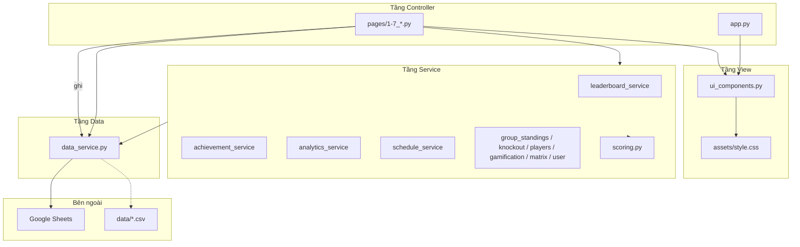

# PROJECT_CONTEXT.md — Tài liệu Kiến trúc Tĩnh

> Nguồn tham chiếu chính cho kiến trúc tĩnh của **World Cup 2026 Predictor**.  
> Bổ sung cho [`README.md`](README.md) (hướng dẫn người dùng) và [`docs/ACHIEVEMENT_ENGINE.md`](docs/ACHIEVEMENT_ENGINE.md) (spec gamification).

---

## 1. Tổng quan dự án

### Mục đích

Ứng dụng web cho nhóm bạn dự đoán kết quả **104 trận** FIFA World Cup 2026. Hệ thống tự động chấm điểm, tính quỹ phạt, xếp hạng và gamification (thanh HP, danh hiệu) dựa trên dữ liệu lưu trên Google Sheets.

### Tech stack  

| Thành phần | Công nghệ |
|------------|-----------|
| Ngôn ngữ | Python 3.12 |
| UI | Streamlit 1.58+ (multi-page app) |
| Xử lý dữ liệu | Pandas |
| Biểu đồ | Plotly Express |
| Giao diện tùy biến | Raw HTML/CSS qua `st.html()` |
| Lưu trữ | Google Sheets qua `gspread` |
| Triển khai | Streamlit Cloud |

### Kiến trúc MVC / hướng Service

| Lớp | Thành phần | Vai trò |
|-----|------------|---------|
| **Controller** | `app.py`, `pages/*.py` | Điều phối luồng: load dữ liệu, xử lý form, gọi service, truyền payload sang View |
| **Model / Data** | `data_service.py`, Google Sheets | Kết nối, đọc/ghi, chuẩn hóa DataFrame |
| **Business Logic** | `*_service.py`, `scoring.py` | Tính điểm, xếp hạng, phân tích, badge, lịch thi đấu |
| **View** | `ui_components.py`, `assets/style.css` | Render HTML/CSS, sidebar, auth UI |

**Lưu ý:** Không có thư mục `/services`. Tất cả module service nằm ở **root** với pattern `*_service.py`.

### Lưu trữ dữ liệu

- **Nguồn sự thật:** Google Sheets (kết nối qua service account trong `st.secrets`).
- **Fallback / seed local:** CSV trong [`data/`](data/) — dùng khi phát triển offline hoặc script bảo trì.

### Xác thực

- Mật khẩu hash SHA-256 (có salt từ `password_salt` trong secrets).
- Session duy trì qua URL ký HMAC (`uid` + `sig`), đồng bộ bởi `sync_auth_session()` trong `ui_components.py`.

### Quy ước kiến trúc

Chi tiết coding rules nằm trong [`.cursorrules`](.cursorrules): công thức HP, ép kiểu DataFrame, quy tắc render UI (không dùng `st.metric` cho banner quan trọng; hero cards BXH qua `render_lb_hero_cards()`).

---

## 2. Sơ đồ kiến trúc hệ thống

### Sơ đồ phân lớp



### Luồng đọc / ghi dữ liệu

**Luồng đọc (Read path):**

```
init_connection() → read_sheet() / read_predictions_sheet() / read_achievements_sheet()
  → normalize_*() / prep_matches()
  → *_service.py (tính toán nghiệp vụ)
  → pages/*.py (controller)
  → render_*() trong ui_components.py
```

**Luồng ghi (Write path):**

```
pages/*.py (form submit / admin action)
  → upsert_user_predictions() / append_user_row() / worksheet.update()
  → data_service.py
  → Google Sheets
```

Các controller dùng `@st.cache_data` / `@st.cache_resource` để cache kết nối và DataFrame, tránh gọi API Sheets lặp lại mỗi lần rerun Streamlit.

### Google Sheets — các tab

| Tab | Nội dung | Đọc | Ghi |
|-----|----------|-----|-----|
| `users` | Tài khoản người chơi | Mọi trang cần auth/BXH | `append_user_row()`, cập nhật tài khoản |
| `predictions` | Dự đoán theo `user_id` + `match_id` | BXH, dự đoán, phân tích | `upsert_user_predictions()` |
| `lineups` | Đội hình chính thức 11 người/đội/trận | Pitch trước trận (T-60 phút) | `read_lineups_sheet()`, `upsert_match_lineups()` |
| `matches` | 104 trận, tỉ số, khóa trận, knock-out | Lịch, BXH, bảng đấu, bracket | Admin (`2_Lich_Thi_Dau.py`) |
| `teams` | Đội, mã FIFA, bảng đấu | Join tên đội khắp app | — |
| `Achievements` | Rule danh hiệu (badge config) | BXH, admin CRUD | `append_achievement_row()`, `update_achievement_row()` |
| `prediction_matrix` | Ma trận dự đoán (trận × người chơi) | — | Admin đẩy từ tab Ma trận |
| `wc2026_full_players_1200` | Danh sách cầu thủ 48 đội | Tra cứu đội hình, panel mini | — |

Hub kết nối: [`data_service.py`](data_service.py) — `init_connection()`, `read_sheet()`, các hàm normalizer và writer.

---

## 3. Cấu trúc thư mục

```
wc2026_predictor/
├── app.py                    # Controller trang chủ (landing, thể lệ, CTA)
├── *_service.py              # Module logic nghiệp vụ (ở root, không có /services)
├── scoring.py                # Tính điểm/phạt, chuẩn hóa kết quả A/D/B
├── team_flags.py             # Mã FIFA → HTML/emoji cờ đội
├── ui_components.py          # Tầng View — renderer HTML/CSS + sidebar auth
├── init_data.py              # Helper đồng bộ kickoff_at cho matches.csv local
├── pages/                    # Controller multi-page Streamlit (7 route tính năng)
├── data/                     # CSV seed/fallback dữ liệu local
├── assets/                   # CSS toàn cục (style.css)
├── docs/                     # Spec nghiệp vụ và hướng dẫn người dùng
├── scripts/                  # Script bảo trì (sync Sheet, repair, verify Playwright)
├── tests/                    # Unit test pytest theo từng service
└── .streamlit/               # Cấu hình Streamlit + secrets (secrets.toml gitignored)
```

### Index module service

| Module | Trách nhiệm |
|--------|-------------|
| [`data_service.py`](data_service.py) | I/O Google Sheets, chuẩn hóa dữ liệu, hash mật khẩu, helper auth |
| [`leaderboard_service.py`](leaderboard_service.py) | Xếp hạng, phạt, biến động thứ hạng, podium, insight theo trận |
| [`achievement_service.py`](achievement_service.py) | Thanh HP (`compute_hp_fields`), engine đánh giá danh hiệu |
| [`leaderboard_gamification_service.py`](leaderboard_gamification_service.py) | Activity feed, sidebar chuỗi thắng/thua |
| [`analytics_service.py`](analytics_service.py) | Momentum, ma trận accuracy, lead time, risk profile, dự báo quỹ |
| [`schedule_service.py`](schedule_service.py) | Enrich lịch FIFA, định dạng kickoff VN, nhãn bảng/vòng |
| [`group_standings_service.py`](group_standings_service.py) | Bảng xếp hạng vòng bảng A–L |
| [`knockout_bracket_service.py`](knockout_bracket_service.py) | Cây nhánh knock-out |
| [`players_service.py`](players_service.py) | Tra cứu đội hình (Sheet + fallback CSV) |
| [`prediction_matrix_service.py`](prediction_matrix_service.py) | Export ma trận dự đoán rộng cho admin |
| [`user_service.py`](user_service.py) | Eligibility người vào muộn (`active_from_kickoff`) |

### Index trang (`pages/`)

| File | Route (sidebar) | Mục đích | Service chính |
|------|-----------------|----------|---------------|
| `1_Du_Doan.py` | Khu vực dự đoán | Đăng nhập, gửi/lưu dự đoán A/D/B; knock-out: chọn đội PEN **chỉ khi** outcome = `D` | `data_service`, `scoring`, `schedule_service`, `players_service` |
| `2_Lich_Thi_Dau.py` | Góc của Elu | Admin: nhập kết quả, khóa trận, CRUD danh hiệu | `data_service`, `achievement_service`, `prediction_matrix_service`, `user_service` |
| `3_Bang_Xep_Hang.py` | Bảng xếp hạng | BXH, HP, badge, phân tích hành vi | `leaderboard_service`, `achievement_service`, `analytics_service`, `leaderboard_gamification_service` |
| `4_Xem_Lich_Thi_Dau.py` | Lịch thi đấu | 104 trận, lọc vòng/bảng, kết quả | `data_service`, `schedule_service`, `scoring` |
| `5_Bang_Dau.py` | Bảng đấu | Bảng A–L theo kết quả thật | `group_standings_service` |
| `6_Bracket_Knockout.py` | Bracket Knock-out | Sơ đồ nhánh loại trực tiếp | `knockout_bracket_service` |
| `7_Tra_Cuu_Doi_Bong.py` | Tra cứu đội hình | 48 đội × 26 cầu thủ | `players_service` |

### Quy ước tách lớp

- **Controller** quyết định *khi nào* load, filter, ghi dữ liệu.
- **Service** quyết định *cách* chấm điểm, xếp hạng, phân tích.
- **View** (`ui_components.py`) quyết định *giao diện* hiển thị — mọi HTML qua `_html()` / `st.html()`.
- **`scoring.py`** là domain math dùng chung bởi controller và nhiều service.

### Quy tắc UI — Form dự đoán (`1_Du_Doan.py`)

| Quy tắc | Chi tiết |
|---------|----------|
| Không dùng `st.form` cho tab dự đoán | Outcome `st.segmented_control` cần rerun tức thì để ẩn/hiện PEN picker |
| Nút lưu | `st.button("💾 Lưu tất cả dự đoán đã chốt")` — batch save các trận đã toggle "Chốt" |
| PEN picker | CSS `pen-picker-shell` + `st.selectbox`; điều kiện `show_pen_picker` (knock-out + Hòa + đủ tên đội) |
| Sentinel | `adv_for_save = "TBD"` khi không phải Hòa knock-out; session key `adv_{user_id}_{match_id}` bị `pop` |

Tham chiếu: [`pages/1_Du_Doan.py`](pages/1_Du_Doan.py) L210–233, L283–316. Chi tiết luồng: [`docs/workflows/03_User_Interaction_Flow.md`](docs/workflows/03_User_Interaction_Flow.md).

---

## 4. Mô hình dữ liệu

Nguồn schema: hằng số `USERS_COLUMNS`, `PREDICTIONS_COLUMNS`, `ACHIEVEMENTS_COLUMNS` và các hàm normalizer trong [`data_service.py`](data_service.py).

### 4.1 Dữ liệu lưu trữ (Google Sheets)

#### Users — tab `users`

| Cột | Kiểu runtime | Ghi chú |
|-----|--------------|---------|
| `user_id` | `str` | Khóa chính, ví dụ `U01` |
| `name` | `str` | Tên hiển thị |
| `password` | `str` | Hash SHA-256 (qua `hash_password()`) |
| `active_from_kickoff` | `Timestamp` (tz `Asia/Ho_Chi_Minh`) hoặc `NaT` | Mốc kickoff bắt đầu tính điểm cho người vào muộn; rỗng = tính mọi trận |

#### Predictions — tab `predictions`

| Cột | Kiểu runtime | Ghi chú |
|-----|--------------|---------|
| `user_id` | `str` | |
| `match_id` | `str` | |
| `pred_outcome` | `str` | Chuẩn `A` / `D` / `B` (Đội A thắng / Hòa / Đội B thắng) |
| `pred_advanced_team_id` | `str` hoặc rỗng | Chỉ ghi Sheet khi `stage_id > 1` **và** `pred_outcome == "D"`. Khi chọn A/B: luôn lưu `""` — controller xóa session key `adv_{user_id}_{match_id}` và gửi `adv_id` rỗng qua `upsert_user_predictions()` |
| `timestamp` | `str` → datetime | Thời điểm chốt dự đoán |

**Quirk Sheet:** Header có thể thiếu; `read_predictions_sheet()` dùng fallback vị trí cột. Cột legacy `pred_score_a`/`pred_score_b` được chuyển sang `pred_outcome` khi đọc.

#### Lineups — tab `lineups`

| Cột | Kiểu runtime | Ghi chú |
|-----|--------------|---------|
| `match_id` | `str` | Khớp `matches.id` |
| `fifa_code` | `str` | Mã FIFA đội |
| `player_name` | `str` | Tên hiển thị chính thức (admin nhập ~1h trước trận) |
| `shirt_number` | `str` | Số áo |
| `slot` | `str` | `GK`, `DF1`–`DF4`, `DM1`–`DM2`, `AM1`–`AM3`, `FW` |
| `formation` | `str` | Ví dụ `4-2-3-1` |
| `updated_at` | `str` | Thời điểm admin lưu |

UI dự đoán chỉ hiện pitch khi `lineups_window_open(kickoff_vn)` (T-60 → kickoff). QA: [`docs/QA_1_Du_Doan.md`](docs/QA_1_Du_Doan.md).

#### Matches — tab `matches` → sau `prep_matches()`

**Cột gốc từ Sheet:**

| Cột | Kiểu runtime | Ghi chú |
|-----|--------------|---------|
| `match_id` | `str` | Đổi tên từ `id` nếu cần |
| `match_number` | `int` | Khóa join với lịch FIFA |
| `home_team_id`, `away_team_id` | `str` | Ép qua `Int64` rồi `str` |
| `city_id` | numeric/str | |
| `stage_id` | `int` | `1` = vòng bảng; `>1` = knock-out |
| `kickoff_at` | `str` | `YYYY-MM-DD HH:MM` (UTC+7) |
| `match_label` | `str` | Ví dụ `Group A` |
| `real_score_a`, `real_score_b` | numeric nullable | Rỗng = chưa đá xong |
| `real_advanced_team_id` | nullable | Đội đi tiếp khi hòa ở knock-out |
| `is_locked` | `bool` | Sheet `"TRUE"` → `True` |

**Cột enrich (qua `schedule_service.enrich_matches_with_schedule()`):**

| Cột | Kiểu runtime | Ghi chú |
|-----|--------------|---------|
| `team_a`, `team_b` | `str` | Tên đội; `"TBD"` nếu thiếu |
| `team_a_fifa`, `team_b_fifa` | `str` | Mã FIFA 3 ký tự |
| `kickoff_utc` | datetime UTC | Từ `data/world-cup-2026-schedule.csv` |
| `kickoff_vn` | datetime tz-aware VN | Dùng cho eligibility, sort |
| `kickoff_vn_date` | `date` | |
| `kickoff_et` | `str` | Giờ Eastern Time |
| `group_round` | `str` | Nhãn bảng/vòng |
| `Venue`, `City` | `str` | |
| `venue_line` | `str` | `"Venue · City"` |
| `host_country` | `str` | |

**Trận đã kết thúc:** `real_score_a.notna() & real_score_b.notna()`.

#### Teams — tab `teams`

| Cột | Kiểu runtime | Ghi chú |
|-----|--------------|---------|
| `id` | `str` | |
| `team_name` | `str` | |
| `fifa_code` | `str` | Mặc định `""` nếu thiếu |
| `group_letter` | `str` | A–L |
| `is_placeholder` | bool/str | Đội placeholder (TBD) |

#### Achievements — tab `Achievements`

Cấu hình **rule** danh hiệu — không phải badge đã đạt (badge được tính runtime).

| Cột | Kiểu runtime | Ghi chú |
|-----|--------------|---------|
| `id` | `str` | Ví dụ `A001` |
| `badge_name` | `str` | Tên hiển thị |
| `metric` | `str` | Phải thuộc `ALLOWED_METRICS` |
| `operator` | `str` | `>`, `>=`, `==`, `<`, `<=` (Sheet lưu `==` thành `eq`) |
| `threshold_value` | float | Ngưỡng so sánh |
| `rarity` | `str` | `Common` / `Rare` / `Legend` |
| `description` | `str` | Mô tả trong gallery |

### 4.2 Dữ liệu tính toán (in-memory)

#### Leaderboard — `leaderboard_service.build_leaderboard_with_dynamics()`

**Cột cốt lõi:**

| Cột | Kiểu | Ý nghĩa |
|-----|------|---------|
| `user_id`, `name` | `str` | |
| `points` | `int` | Tổng điểm |
| `fines` | `int` | Phạt theo đơn vị 10k VNĐ (10 = 10.000 VNĐ) |
| `played` | `int` | Số trận đã dự đoán (eligible + finished) |
| `correct` | `int` | Số trận đúng (`match_pts >= 3`) |
| `missed` | `int` | Số trận bỏ lỡ |
| `total_finished` | `int` | Tổng trận eligible đã kết thúc |
| `hit_rate` | `float` | `correct/played * 100` |
| `rank` | `int` | Thứ hạng (unique, không hòa) |
| `rank_label` | `str` | 🥇/🥈/🥉 hoặc số |
| `current_streak` | `int` | Chuỗi W/L gần nhất (+ thắng, − thua) |

**Cột enrich (dynamics + gamification):**

| Cột | Kiểu | Ý nghĩa |
|-----|------|---------|
| `rank_movement_delta` | `int` | Biến động thứ hạng so với snapshot trước |
| `rank_movement` | `str` | `▲ N` / `▼ N` / `➖` |
| `recent_form` | `list[str]` | 5 kết quả gần nhất (`W`/`L`/`D`) |
| `remaining_hp` | `int` | Sinh lực còn lại |
| `remaining_hp_pct` | `float` | % HP |
| `badges` | `list[str]` | Danh hiệu đang đạt |

#### Scored predictions — `analytics_service.build_scored_predictions()`

Merge `predictions` + trận đã kết thúc + tên user, thêm cột `points` (`int`), `actual_outcome`, `pred_outcome` đã chuẩn hóa.

#### Các DataFrame phân tích khác

| Hàm | Cột output chính |
|-----|------------------|
| `get_cumulative_scores()` | `user_id`, `name`, `kickoff_vn`, `match_number`, `points`, `cumulative_points` |
| `get_prediction_lead_time()` | `user_id`, `match_id`, `kickoff_vn`, `timestamp`, `lead_hours`, `is_late` |
| `calculate_crowd_consensus()` | `match_id`, `favorite_pick`, `consensus_votes`, `total_votes` |
| `get_user_risk_profile()` | `user_id`, `name`, `pick_type`, `n_picks`, `pct` |
| `build_prediction_matrix()` | `Trận`, `Cặp đấu`, + cột động theo tên user |

#### Dữ liệu phụ (CSV static)

| File | Cột chính |
|------|-----------|
| `data/tournament_stages.csv` | `id`, `stage_name`, `stage_order` |
| `data/host_cities.csv` | `id`, `city_name`, `country`, `venue_name`, `region_cluster`, `airport_code` |
| `data/wc2026_full_players_1200.csv` | `team`, `team_code`, `position`, `player_name`, `dob`, `club`, `height_cm`, `caps`, `goals` |

### 4.3 Quy tắc ép kiểu nghiêm ngặt

> Áp dụng xuyên suốt mọi service và page — xem [`.cursorrules`](.cursorrules).

| Quy tắc | Cách thực hiện |
|---------|----------------|
| Khóa merge | `user_id`, `match_id` → **luôn** `.astype(str)` trước merge/groupby/lookup |
| Cột số | `points`, `fines` → `pd.to_numeric(..., errors="coerce").fillna(0)` |
| Datetime | `kickoff_vn`, `timestamp` → `pd.to_datetime(..., format="mixed", errors="coerce", utc=True)` khi trừ hai datetime |
| Bool từ Sheet | `is_locked` → `astype(str).str.strip().str.upper() == "TRUE"` |
| Team ID | `pd.to_numeric(...).astype(Int64).astype(str)` — an toàn với NaN |
| Outcome | `normalize_pred_outcome()` → chỉ `A` / `D` / `B` |

### 4.4 Hằng số gamification

| Hằng số | Giá trị | Ý nghĩa |
|---------|---------|---------|
| `MAX_HP` | **104** | Ngân sách phạt tối đa 1.040.000 VNĐ |
| `FINE_UNIT_HP` | **10** | 1 HP = 10.000 VNĐ; cột `fines` lưu theo hệ số 10 |
| `FINE_MISSED_MATCH` | **10** | Phạt bỏ lỡ 1 trận (cùng đơn vị) |
| Phạt dự đoán sai | **10** | Qua `calculate_fines()` trong `scoring.py` |
| `TOTAL_MATCHES` | **104** | Tổng số trận giải |

**Công thức HP** — luôn dùng `compute_hp_fields(fines_k)` từ `achievement_service.py`:

```
hp_lost = fines // FINE_UNIT_HP
remaining_hp = max(0, MAX_HP - hp_lost)
remaining_hp_pct = round(remaining_hp / MAX_HP * 100, 1)
```

**Metric cho rule badge** (`ALLOWED_METRICS` — 9 khóa):

`total_penalties`, `points`, `hit_rate`, `correct`, `missed`, `played`, `remaining_hp`, `win_streak`, `lose_streak`

**Độ hiếm badge:** `Common`, `Rare`, `Legend`

> **Lưu ý:** `docs/ACHIEVEMENT_ENGINE.md` có thể ghi `MAX_HP = 140` (bản cũ). **Code hiện tại dùng 104** — tin `achievement_service.py`.

---

## 5. Dependencies cốt lõi

### Production — [`requirements.txt`](requirements.txt)

| Thư viện | Phiên bản | Mục đích |
|----------|-----------|----------|
| `streamlit` | >=1.58.0 | Framework UI web multi-page |
| `pandas` | — | Thao tác DataFrame, chuẩn hóa dữ liệu Sheet |
| `gspread` | — | API đọc/ghi Google Sheets |
| `gspread-dataframe` | — | Helper chuyển đổi DataFrame ↔ worksheet |
| `google-auth` | — | Xác thực service account GCP |
| `plotly` | — | Biểu đồ tương tác (tab phân tích BXH) |

### Dev / ngầm định

| Thành phần | Mục đích |
|------------|----------|
| Python 3.12 | Runtime (theo `.cursorrules`) |
| `pytest` | Chạy unit test trong [`tests/`](tests/) |
| `playwright` | Script verify UI trong [`scripts/`](scripts/) (tùy chọn) |

### Secrets (`.streamlit/secrets.toml` — không commit)

| Key | Mục đích |
|-----|----------|
| `spreadsheet_id` | ID Google Spreadsheet |
| `password_salt` | Salt hash mật khẩu người chơi |
| `gcp_service_account` | JSON service account (scopes: spreadsheets + drive) |

---

## Tài liệu liên quan

| File | Nội dung |
|------|----------|
| [`README.md`](README.md) | Hướng dẫn cài đặt, chạy app, thể lệ người chơi |
| [`.cursorrules`](.cursorrules) | Quy tắc kiến trúc cho AI/developer |
| [`docs/ACHIEVEMENT_ENGINE.md`](docs/ACHIEVEMENT_ENGINE.md) | Spec chi tiết engine danh hiệu và HP |
| [`docs/HUONG_DAN_DU_DOAN.md`](docs/HUONG_DAN_DU_DOAN.md) | Hướng dẫn người chơi không cần biết kỹ thuật |
| [`data_service.py`](data_service.py) | Hub I/O Google Sheets và normalizer |
