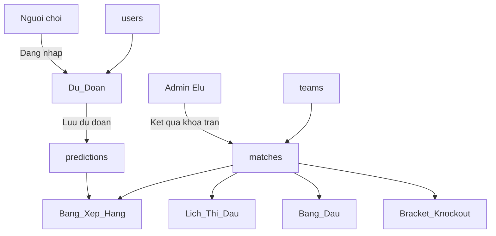

# World Cup 2026 Predictor

Ứng dụng web cho nhóm bạn dự đoán kết quả **104 trận** FIFA World Cup 2026 — chấm điểm, quỹ phạt và bảng xếp hạng tự động từ dữ liệu Google Sheets.

**Live:** [wc2026-elu.streamlit.app](https://wc2026-elu.streamlit.app)

**Hướng dẫn người chơi (không cần biết kỹ thuật):** [docs/HUONG_DAN_DU_DOAN.md](docs/HUONG_DAN_DU_DOAN.md)

---

## Tính năng chính

| Trang | Đường dẫn | Mô tả |
|-------|-----------|--------|
| Trang chủ | `/` | Thể lệ, điểm/phạt, lối tắt các khu vực |
| Khu vực dự đoán | `/Du_Doan` | Đăng nhập, chốt và lưu dự đoán (yêu cầu tài khoản) |
| Bảng xếp hạng | `/Bang_Xep_Hang` | Điểm, quỹ phạt, phân tích phong cách dự đoán |
| Lịch thi đấu | `/Xem_Lich_Thi_Dau` | 104 trận, lọc vòng bảng / knock-out, kết quả |
| Bảng đấu | `/Bang_Dau` | 12 bảng A–L, cập nhật theo kết quả thật |
| Bracket Knock-out | `/Bracket_Knockout` | Sơ đồ nhánh loại trực tiếp |
| Tra cứu đội hình | `/Tra_Cuu_Doi_Bong` | 48 đội × 26 cầu thủ — caps, bàn, CLB |
| Góc của Elu | `/Lich_Thi_Dau` | Admin: nhập kết quả, khóa trận, cài knock-out |

---

## Thể lệ (tóm tắt)

| Hành động | Điểm / phạt |
|-----------|-------------|
| Đoán đúng kết quả (Đội A thắng / Hòa / Đội B thắng) | **+3 điểm** |
| Vòng knock-out: chọn Hòa **và** đúng đội đi tiếp sau loạt penaty | **+1 điểm** (cộng thêm) |
| Đoán sai kết quả | **Phạt 10k** vào quỹ |

Chi tiết logic: [`scoring.py`](scoring.py).

---

## Luồng hệ thống



1. Người chơi đăng nhập tại **Khu vực dự đoán** → chọn kết quả → **Chốt** → **Lưu** → ghi vào sheet `predictions`.
2. Admin cập nhật tỉ số / khóa trận trên sheet `matches` qua **Góc của Elu**.
3. Các trang còn lại đọc dữ liệu chung và tính điểm/phạt tự động.

---

## Kiến trúc kỹ thuật

| Thành phần | Công nghệ |
|------------|-----------|
| UI | [Streamlit](https://streamlit.io/) 1.58+ (multi-page app) |
| Lưu trữ | Google Sheets qua `gspread` |
| Auth | SHA-256 mật khẩu + HMAC session (`uid` / `sig` trên URL) |
| Deploy | Streamlit Cloud |

### Google Sheets (tabs)

| Sheet | Nội dung |
|-------|----------|
| `users` | `user_id`, `name`, `password`, `active_from_kickoff` (tùy chọn — trận bắt đầu tính điểm cho user mới) |
| `predictions` | Dự đoán theo `user_id` + `match_id` |
| `matches` | Lịch 104 trận, tỉ số, khóa trận, knock-out |
| `teams` | Đội, mã FIFA, bảng đấu |
| `prediction_matrix` | Ma trận dự đoán (admin đẩy từ app) — trận × người chơi |
| `wc2026_full_players_1200` | Danh sách cầu thử 48 đội (1248 dòng) |

Kết nối: [`data_service.py`](data_service.py).

### Cấu trúc repo (rút gọn)

```
app.py                    # Trang chủ
pages/
  1_Du_Doan.py            # Dự đoán + đăng nhập
  2_Lich_Thi_Dau.py       # Admin
  3_Bang_Xep_Hang.py
  4_Xem_Lich_Thi_Dau.py
  5_Bang_Dau.py
  6_Bracket_Knockout.py
  7_Tra_Cuu_Doi_Bong.py   # Tra cứu đội hình
players_service.py
scoring.py                # Điểm, phạt, format hiển thị
schedule_service.py       # Lịch, nhãn bảng, màu
group_standings_service.py
knockout_bracket_service.py
prediction_matrix_service.py
ui_components.py          # Sidebar, login, UI dự đoán
assets/style.css
leaderboard_service.py
tests/                    # pytest (logic thuần, không cần Sheet thật)
docs/
  HUONG_DAN_DU_DOAN.md    # Hướng dẫn người chơi
```

---

## Chạy local (developer)

**Yêu cầu:** Python 3.11+, tài khoản Google Service Account có quyền đọc/ghi spreadsheet.

```bash
python -m venv .venv
source .venv/bin/activate   # Windows: .venv\Scripts\activate
pip install -r requirements.txt
```

Tạo `.streamlit/secrets.toml` (không commit file này):

```toml
spreadsheet_id = "YOUR_SHEET_ID"
password_salt = "YOUR_SALT"

[gcp_service_account]
type = "service_account"
project_id = "..."
private_key_id = "..."
private_key = "..."
client_email = "..."
client_id = "..."
# ... các trường còn lại từ JSON key
```

```bash
streamlit run app.py
```

Chạy tests:

```bash
PYTHONPATH=. pytest -q
PYTHONPATH=. pytest tests/test_leaderboard_service.py -q   # ví dụ: một module
```

---

## Người chơi (14 tài khoản)

Đăng nhập bằng **tên hiển thị** hoặc **mã** (`U01` … `U14`). Mật khẩu do admin cấp riêng — không lưu trong repo.

| Mã | Tên hiển thị |
|----|----------------|
| U01 | TonyDo⚽️❤️❤️ |
| U02 | Nghia |
| U03 | Tan |
| U04 | Quan |
| U05 | Huy |
| U06 | Thinh |
| U07 | Nam |
| U08 | Bao |
| U09 | Mèo Đi Vớ🦁 |
| U10 | Ga |
| U11 | Hoang |
| U12 | Ning |
| U13 | Hieu |
| U14 | Elu *(admin)* |

Hướng dẫn chi tiết từng bước: [docs/HUONG_DAN_DU_DOAN.md](docs/HUONG_DAN_DU_DOAN.md).

---

## Bảo mật

- Không commit `.streamlit/secrets.toml`, file JSON GCP, hay mật khẩu người dùng.
- Mật khẩu trên sheet `users` nên dùng bản hash (SHA-256 + salt); app vẫn chấp nhận plain text tạm thời khi migrate.
- Session đăng nhập gắn chữ ký HMAC trên URL để giữ phiên khi refresh trang.

---

## Roadmap (tóm tắt)

| Sprint | Nội dung | Trạng thái |
|--------|----------|------------|
| 2.x | Sidebar, lịch sử, admin fixes | Done |
| 3 | Bảng đấu, bracket knock-out | Done |
| 4.5 | Deploy, README, flagcdn lịch sử | Done |
| 5 | Ma trận dự đoán → tab `prediction_matrix` trên Google Sheet | Done |
| 6 | Tra cứu đội hình 48 đội | Done |

Chi tiết: [docs/UI_SCORECARD.md](docs/UI_SCORECARD.md).

---

## Tài liệu khác

- [Hướng dẫn sử dụng Dự đoán](docs/HUONG_DAN_DU_DOAN.md) — dành cho người chơi
- [UI Scorecard](docs/UI_SCORECARD.md) — audit UI / roadmap nội bộ

---

*WC 2026 Predictor — Elucidator & friends*
