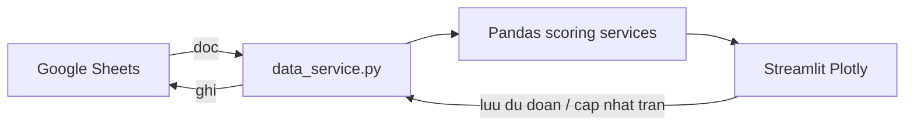

# World Cup 2026 Predictor

Ứng dụng web dự đoán kết quả **104 trận** FIFA World Cup 2026 cho nhóm nội bộ khoảng 14 người. Trước đây, mỗi vòng đấu đều lặp lại cùng một quy trình thủ công trên Google Sheets và Excel: thu thập dự đoán, admin nhập tỉ số, kéo công thức tính điểm và quỹ phạt, rồi cập nhật bảng xếp hạng. 

**Demo:** [wc2026-elu.streamlit.app](https://wc2026-elu.streamlit.app) 
**Test user cho tab "Dự đoán":** ID: testUser , Password: 12345

**GGsheet data:**[WC2026-database](https://docs.google.com/spreadsheets/d/1zSQ5ewWTy75ptpTLArZ0bFUFz-jbPs2677rKCpxjtsQ/edit?usp=sharing) (liên hệ admin nếu cần truy cập vào file data và password truy cập vào tab Admin của webapp)

### Tài liệu kỹ thuật cốt lõi

Hai file dưới đây là **bản đồ chính** của dự án — một file cho **toàn bộ quá trình phát triển** (data → logic → UI), một file cho **luồng phân tích nâng cao** (file Python, DataFrame, biểu đồ Plotly). Nên đọc Roadmap trước để nắm bức tranh toàn cảnh, rồi mở Analytics Flow khi đi sâu tab *Phân tích dữ liệu hành vi*.

| | **develop_roadmap.md** | **05_Behavior_Analytics_Flow.md** |
|---|------------------------|-----------------------------------|
| **Vai trò** | Vòng đời dự án — 5 giai đoạn pipeline | Walkthrough code — khả năng xử lý analytics |
| **Nội dung** | Seed CSV / chuẩn hóa → gspread & cache → chấm điểm & BXH → analytics → MVC & HTML/CSS render | Controller → `build_analytics_bundle` → 5 sub-tab: Momentum, Accuracy, Lead Time, Risk Bias, Fund Forecast |
| **Module chính** | `data_service.py`, `scoring.py`, `leaderboard_service.py`, `achievement_service.py`, `pages/`, `ui_components.py` | `analytics_service.py`, `pages/3_Bang_Xep_Hang.py`, `scoring.py`, Plotly Express |
| **Đọc ngay** | [docs/develop_roadmap.md](docs/develop_roadmap.md) | [docs/workflows/05_Behavior_Analytics_Flow.md](docs/workflows/05_Behavior_Analytics_Flow.md) |

---

## 1. Lời mở đầu

Nhóm chơi dự đoán World Cup theo thể lệ tự đặt: đoán đúng được cộng điểm, đoán sai nộp phạt vào quỹ chung. Với 104 trận và hơn chục người tham gia, việc vận hành bằng bảng tính trở nên tốn thời gian và dễ sai sót — đặc biệt sau mỗi trận khi phải làm lại cùng một chuỗi thao tác.

World Cup 2026 Predictor giữ nguyên luật chơi của nhóm, nhưng chuyển toàn bộ quy trình lặp sang chương trình: dữ liệu lưu trên Google Sheets, logic tính toán viết bằng Python, giao diện web hiển thị kết quả ngay khi có tỉ số mới.

---

## 2. So sánh Trước / Sau

| Khía cạnh | Trước (Sheet / Excel thủ công) | Sau (Predictor) |
|-----------|-------------------------------|-----------------|
| Thu thập dự đoán | Form rời, copy vào nhiều tab | Form web → ghi thẳng vào Sheet |
| Cập nhật kết quả trận | Admin sửa Sheet, tính lại công thức tay | Admin nhập tỉ số → điểm/phạt tự tính |
| Bảng xếp hạng | Export hoặc chỉnh bảng thủ công | Cập nhật ngay trên web |
| Ma trận dự đoán | Pivot Excel khi cần tổng hợp | View admin tự render |

### Công nghệ và việc tự động hóa

| Công nghệ | Thay thế việc gì |
|-----------|------------------|
| **gspread** | Tự động kết nối và đồng bộ Google Sheets — không cần tải file CSV hay copy dữ liệu tay giữa các tab |
| **Pandas** | Tự động hóa các công thức tính toán phức tạp (chấm điểm, quỹ phạt VNĐ, xếp hạng) mà trước đây phải kéo hàm Excel sau mỗi trận |
| **Streamlit + Plotly** | Tự động tạo báo cáo trực quan (bảng xếp hạng, biểu đồ phân tích) ngay khi admin cập nhật kết quả mới |

Module trung tâm: [`data_service.py`](data_service.py) (đọc/ghi Sheet), [`scoring.py`](scoring.py) và [`leaderboard_service.py`](leaderboard_service.py) (tính toán), [`pages/`](pages/) và [`ui_components.py`](ui_components.py) (hiển thị).

---

## 3. Luồng dữ liệu

Dữ liệu đi theo một vòng lặp đơn giản: đọc từ Sheet → xử lý bằng Pandas → hiển thị trên Streamlit; khi người dùng lưu dự đoán hoặc admin nhập kết quả, dữ liệu ghi ngược về Sheet và giao diện làm mới.



**Luồng đọc**

1. `init_connection()` kết nối Google Sheets qua service account.
2. `read_sheet()`, `read_predictions_sheet()` đọc tab `users`, `matches`, `predictions`.
3. `prep_matches()` chuẩn hóa dữ liệu; merge dự đoán với kết quả thật.
4. `scoring.py` tính điểm/phạt; `leaderboard_service.py` dựng bảng xếp hạng.
5. Streamlit render BXH, lịch thi đấu, biểu đồ phân tích.

**Luồng ghi**

1. Thành viên lưu dự đoán → `upsert_user_predictions()` ghi tab `predictions`.
2. Admin nhập tỉ số và khóa trận → cập nhật tab `matches`.
3. Sau mỗi lần ghi, cache được xóa và trang tự tải lại — báo cáo luôn khớp dữ liệu mới nhất.

Chi tiết code-level theo từng giai đoạn: [docs/develop_roadmap.md](docs/develop_roadmap.md) (mục 2–5). Luồng analytics & Plotly: [docs/workflows/05_Behavior_Analytics_Flow.md](docs/workflows/05_Behavior_Analytics_Flow.md).

---

## 4. Logic

Thể lệ thiết kế và mã hóa trong [`scoring.py`](scoring.py):

| Hành động | Điểm / phạt |
|-----------|-------------|
| Đoán đúng kết quả (Đội A thắng / Hòa / Đội B thắng) | **+3 điểm** |
| Vòng knock-out: chọn Hòa **và** đúng đội đi tiếp sau loạt penaty | **+1 điểm** (cộng thêm) |
| Đoán sai kết quả | **Phạt 10.000 VNĐ** vào quỹ (lưu hệ số 10 trong dữ liệu) |

**Quy tắc triển khai**

- Chỉ chấm điểm/phạt khi trận đã có kết quả thật và được admin khóa (`locked`).
- Kết quả dự đoán chuẩn hóa thành ba giá trị: `A` (đội A thắng), `D` (hòa), `B` (đội B thắng) — so sánh với tỉ số thật, không so sánh tỉ số số học.
- Điểm cộng thêm +1 cho penaty chỉ áp dụng vòng knock-out (`stage > 1`), khi cả dự đoán lẫn kết quả thật đều là Hòa và đúng đội đi tiếp.
- Thiếu dự đoán trước khi trận khóa được coi là sai → phạt 10k.

Bảng xếp hạng tổng hợp điểm, quỹ phạt, chuỗi thắng/thua trong [`leaderboard_service.py`](leaderboard_service.py). Thanh HP và danh hiệu (gamification) tính từ quỹ phạt tích lũy — chi tiết trong [`PROJECT_CONTEXT.md`](PROJECT_CONTEXT.md).

---

## 5. Tech Stack & Cài đặt

### Tech stack

| Thành phần | Công nghệ |
|------------|-----------|
| Ngôn ngữ | Python 3.12 |
| Giao diện | [Streamlit](https://streamlit.io/) 1.58+ |
| Xử lý dữ liệu | Pandas |
| Biểu đồ | Plotly Express |
| Lưu trữ | Google Sheets qua `gspread` |
| Kiểm thử | pytest |
| Triển khai | Streamlit Cloud |

Dữ liệu nguồn nằm trên Google Sheets (các tab chính: `users`, `predictions`, `matches`, `teams`, `lineups`).

### Các trang ứng dụng

| Trang | Đường dẫn | Chức năng |
|-------|-----------|-----------|
| Trang chủ | `/` | Thể lệ, bracket knock-out, tóm tắt điểm/phạt |
| Khu vực dự đoán | `/Du_Doan` | Đăng nhập, chốt và lưu dự đoán |
| Bảng xếp hạng | `/Bang_Xep_Hang` | Điểm, quỹ phạt, phân tích, danh hiệu |
| Lịch thi đấu | `/Xem_Lich_Thi_Dau` | 104 trận, lọc vòng bảng / knock-out |
| Bảng đấu | `/Bang_Dau` | 12 bảng A–L theo kết quả thực |
| Bracket Knock-out | `/Bracket_Knockout` | Sơ đồ nhánh loại trực tiếp |
| Tra cứu đội hình | `/Tra_Cuu_Doi_Bong` | 48 đội, thông tin cầu thủ |
| Khu vực quản trị | `/Lich_Thi_Dau` | Nhập kết quả, khóa trận, đội hình |

### Cài đặt

```bash
python -m venv .venv
source .venv/bin/activate
pip install -r requirements.txt
streamlit run app.py
```

Cấu hình kết nối Google Sheets qua Streamlit Cloud secrets hoặc file `.streamlit/secrets.toml` (không commit): cần `spreadsheet_id`, `gcp_service_account` (JSON service account), và `password_salt` cho hash mật khẩu.

Kiểm thử logic tính toán:

```bash
PYTHONPATH=. pytest -q
```

### Bảo mật

- Không commit secrets, file JSON GCP hay mật khẩu người dùng.
- Mật khẩu trên tab `users` lưu dạng hash SHA-256; session đăng nhập gắn chữ ký HMAC trên URL.

---

## Tài liệu liên quan

| Tài liệu | Mục đích |
|----------|----------|
| [develop_roadmap.md](docs/develop_roadmap.md) | Roadmap 5 giai đoạn — seed data → ingestion → scoring → analytics → render |
| [05_Behavior_Analytics_Flow.md](docs/workflows/05_Behavior_Analytics_Flow.md) | Luồng phân tích hành vi — Pandas, Plotly, 5 sub-tab BXH |
| [PROJECT_CONTEXT.md](PROJECT_CONTEXT.md) | Kiến trúc MVC, schema Sheet, gamification (HP, badges) |
