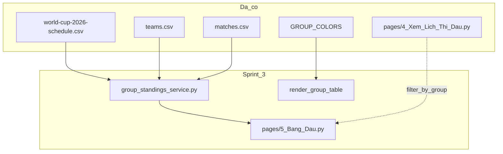

# UI Scorecard — WC 2026 Predictor

---

## Cách chấm điểm

| Thang | Ý nghĩa |
|-------|---------|
| 9–10 | Production-ready, không cần chỉnh thêm |
| 7–8  | Tốt, còn vài điểm polish |
| 5–6  | Dùng được, có bug/UX rõ ràng |
| <5   | Cần refactor |

**Viewport:** Desktop (≥1280px) · Tablet (770–1100px) · iPad portrait / Mobile (≤769px)

---

## Baseline — 2026-06-10 (trước sprint 1)

Audit trang **Dự đoán** (`pages/1_Du_Doan.py`), user U01, card trận đấu.

| Tiêu chí | Desktop | Mobile | Ghi chú |
|----------|---------|--------|---------|
| Visual design | 7.5 | 8.0 | Dark theme ổn, badge/pill tabs đẹp |
| Information hierarchy | 8.0 | 8.5 | Meta → kickoff → teams → picker → chốt |
| Responsive | **6.5** | 8.5 | Desktop 2 cột: tên đội vỡ giữa chữ |
| Interaction clarity | 7.0 | 7.5 | Nút Lưu cuối form, dễ miss khi scroll |
| **Tổng** | **7.3** | **8.1** | |

### Backlog ưu tiên (baseline)

- [x] P0 — Fix word-break tên đội (desktop 2 cột)
- [x] P1 — Kickoff 2 dòng trên mobile
- [x] P1 — Sticky CTA Lưu + giảm 10 → 5 trận/lần
- [ ] P1 — Nhất quán màu segmented control (focus vs active)
- [ ] P1 — Badge "Đã dự đoán" vs giá trị picker hiện tại
- [ ] P2 — Group label dot màu (đồng bộ trang Lịch thi đấu)
- [ ] P2 — Thứ tự card khi stack 1 cột (0,2,4,1,3) trên iPad
- [ ] P2 — Trang Home CTA polish
- [ ] P2 — Trang Lịch thi đấu (fixture rows)
- [ ] P2 — Trang Bảng xếp hạng
- [x] P3 — Login flow UX *(done Sprint 1.9)*
- [x] P3 — Lịch sử: feedback kết quả thật *(done Sprint 2.1)*
- [x] P3 — Lịch sử: chuỗi dài mobile *(done Sprint 2.1)*

---

## Sprint 1 — Prediction cards (2026-06-10)

**Phạm vi:** 3 fix đầu từ audit card dự đoán.

| # | Việc | File | Trạng thái |
|---|------|------|------------|
| 1 | Tên đội không vỡ giữa chữ; 1 cột ≤1100px | `assets/style.css` | ✅ Done |
| 2 | Kickoff primary + secondary (2 dòng) | `ui_components.py`, CSS | ✅ Done |
| 3 | Sticky Lưu + max 5 trận | `pages/1_Du_Doan.py`, CSS | ✅ Done |

### Điểm sau Sprint 1

| Tiêu chí | Desktop | Mobile | Δ Desktop | Δ Mobile |
|----------|---------|--------|-----------|----------|
| Visual design | 8.0 | 8.5 | +0.5 | +0.5 |
| Information hierarchy | 8.5 | 8.5 | +0.5 | 0 |
| Responsive | **8.8** | **8.8** | **+2.3** | +0.3 |
| Interaction clarity | **8.5** | **8.5** | **+1.5** | +1.0 |
| **Tổng** | **8.5** | **8.6** | +1.2 | +0.5 |

---

## Sprint 1.5 — iPad portrait fix (2026-06-10)

**Phạm vi:** Bug iPad Mini/Air portrait 768px — letterbox, card clip, cờ/tên vỡ.

| # | Việc | File | Trạng thái |
|---|------|------|------------|
| 1 | Sidebar overlay ≤769px → main full width | `assets/style.css` | ✅ Done |
| 2 | Card không clip; padding sticky Lưu | `assets/style.css` | ✅ Done |
| 3 | Cờ + tên `nowrap` trên tablet | `assets/style.css` | ✅ Done |
| 4 | Login bỏ `st.columns([1,2.2,1])` | `pages/1_Du_Doan.py` | ✅ Done |
| 5 | Verify U01/12345 @ 768px | Playwright + iPad thật | ✅ Done |

**Verify số liệu (768px):** container 768px · card ~667px · sidebar overlay (không chiếm layout)

### Điểm sau Sprint 1.5

| Tiêu chí | Desktop | Tablet | iPad/Mobile |
|----------|---------|--------|-------------|
| Visual design | 8.0 | 8.5 | 8.5 |
| Information hierarchy | 8.5 | 8.5 | 8.5 |
| Responsive | 8.8 | 9.0 | **9.2** |
| Interaction clarity | 8.5 | 8.5 | 8.5 |
| **Tổng** | **8.5** | **8.6** | **8.7** |

---

## Sprint 1.75 — Desktop 2 cột restore (2026-06-10)

### Senior audit — TRƯỚC khi sửa *(regression sau Sprint 1.5)*

> Góc nhìn senior 10 năm · user U01 · PC ~1280px · sidebar open/close

| Vấn đề | Mức | Ghi chú |
|--------|-----|---------|
| Card full-width 1 cột trên desktop | **P0** | Card ~750px — picker/VS bị kéo giãn, mất density |
| Mất layout 2 cột ban đầu | **P0** | `st.columns(2)` bị thay bằng 1 container + CSS grid không match DOM Streamlit |
| CSS grid không hoạt động | P1 | Selector `> div > stVerticalBlock` sai; `display:grid` không apply |
| Sidebar flex reflow | ✅ Giữ | Main co/giãn theo sidebar — ấn tượng, nên giữ |
| iPad 768px | ✅ OK | Full width, 1 card/row — không regress |

**Điểm regression (ước lượng):**

| Tiêu chí | Desktop | Tablet | iPad |
|----------|---------|--------|------|
| Visual design | **7.0** ↓ | 8.5 | 8.5 |
| Responsive | **7.5** ↓ | 9.0 | 9.2 |
| **Tổng** | **7.6** ↓ | 8.6 | 8.7 |

### Fix áp dụng

| # | Việc | File | Trạng thái |
|---|------|------|------------|
| 1 | Khôi phục `st.columns(2)` khi ≥3 trận | `pages/1_Du_Doan.py` | ✅ Done |
| 2 | CSS selector đúng DOM: `stForm > stVerticalBlock > stLayoutWrapper > stHorizontalBlock` | `assets/style.css` | ✅ Done |
| 3 | ≤769px: `flex-direction: column` (1 card/row) | `assets/style.css` | ✅ Done |
| 4 | ≥770px: `flex-direction: row` (2 cột) | `assets/style.css` | ✅ Done |
| 5 | Giữ sidebar overlay ≤769px | `assets/style.css` | ✅ Done |

**Verify số liệu sau fix:**

| Viewport | Card width | Layout | Ghi chú |
|----------|------------|--------|---------|
| 768px | ~667px | 1 cột stack | Sidebar overlay |
| 1280px | ~325px × 2 cột | 2 cột xen kẽ | Khôi phục layout đẹp ban đầu |

### Senior audit — SAU khi sửa

| Tiêu chí | Desktop | Tablet | iPad/Mobile | Nhận xét |
|----------|---------|--------|-------------|----------|
| Visual design | **8.5** | 8.5 | 8.5 | Card density desktop trở lại chuẩn |
| Information hierarchy | 8.5 | 8.5 | 8.5 | 2 cột giúp scan nhanh hơn trên PC |
| Responsive | **9.0** | **9.0** | **9.2** | Breakpoint 769/770 rõ ràng |
| Interaction clarity | 8.5 | 8.5 | 8.5 | Sticky Lưu + sidebar reflow vẫn tốt |
| **Tổng** | **8.6** | **8.6** | **8.7** | |

**Còn thiếu để 10/10:** badge vs picker sync, group dot màu, thứ tự card iPad khi stack (P2), polish toàn app.

---

## Sprint 1.8 — Sidebar overlay ≤1330px (2026-06-10)

**Phạm vi:** Tablet/laptop — main không co/giãn khi mở/đóng sidebar.

| # | Việc | File | Trạng thái |
|---|------|------|------------|
| 1 | Sidebar `position: fixed` overlay ≤1330px | `assets/style.css` | ✅ Done |
| 2 | Main giữ 100% width (không letterbox) | `assets/style.css` | ✅ Done |
| 3 | Backdrop + `wc-sidebar-open` pointer-events | `assets/style.css`, `ui_components.py` | ✅ Done |
| 4 | Toolbar z-index không che nút đóng sidebar | `assets/style.css` | ✅ Done |

**Verify:** PC ~1280px · main width không đổi khi toggle sidebar · sidebar z-index trên toolbar

---

## Sprint 1.85 — Click outside đóng sidebar (2026-06-10)

**Phạm vi:** Bug — click vùng tối ngoài sidebar không đóng menu.

| Vấn đề | Root cause | Fix |
|--------|------------|-----|
| Backdrop click không đóng | JS chạy trong iframe; `btn.click()` không trigger React | Inject script vào `window.top`, gọi `__reactProps.onClick` |
| `body.wc-sidebar-open` không set | Race + wrong document context | `setSidebarOpenClass` trên `html`/`body`/`stApp` |
| Backdrop recreate liên tục | MutationObserver mỗi DOM change | Debounce `syncBackdrop`, giữ backdrop nếu đã có |

| # | Việc | File | Trạng thái |
|---|------|------|------------|
| 1 | Boot script v2 inject main document | `ui_components.py` | ✅ Done |
| 2 | `collapseSidebar()` via React onClick | `ui_components.py` | ✅ Done |
| 3 | Page-change cleanup (backdrop stuck) | `ui_components.py` | ✅ Done |
| 4 | Verify browser @1280px | Cursor browser CDP | ✅ Done |

---

## Sprint 1.9 — Polish sprint (2026-06-10)

**Phạm vi:** Kickoff card, login width, lịch sử dự đoán format.

| # | Việc | File | Trạng thái |
|---|------|------|------------|
| 1 | Kickoff card: bỏ ET + UTC+7 → `02:00 · T6, 12/06` | `ui_components.py`, CSS | ✅ Done |
| 2 | Login form 480px align header card | `assets/style.css` | ✅ Done |
| 3 | History format: `→` plain text (không `**` markdown) | `scoring.py` | ✅ Done |
| 4 | Thống nhất `🤝 Hòa` (có dấu) | `scoring.py` | ✅ Done |
| 5 | History table column widths | `pages/1_Du_Doan.py` | ✅ Done |

**Format lịch sử (sau fix P0+P1):**

```
🇲🇽 Mexico - 🇿🇦 South Africa → 🇿🇦 South Africa thắng
🇺🇸 USA - 🇵🇾 Paraguay → 🤝 Hòa
```

### Điểm sau Sprint 1.9

| Tiêu chí | Desktop | Tablet | iPad/Mobile | Δ Desktop |
|----------|---------|--------|-------------|-----------|
| Visual design | **8.7** | 8.6 | 8.6 | +0.2 |
| Information hierarchy | **8.6** | 8.5 | 8.5 | +0.1 |
| Responsive | **9.0** | **9.0** | **9.2** | 0 |
| Interaction clarity | **9.0** | 8.8 | 8.8 | +0.5 |
| **Tổng** | **8.8** | **8.7** | **8.8** | +0.2 |

**Còn thiếu để 10/10:** badge vs picker sync, group dot màu, thứ tự card iPad stack, visualize bảng đấu (Sprint 3).

---

## Pre-push checklist (2026-06-11 — Sprint 2.x)

| Gate | Status | Ghi chú |
|------|--------|---------|
| Unit tests (35) | ✅ | scoring + schedule + team_flags + sidebar overlay |
| Playwright verify | ✅ | `scripts/verify_sidebar_overlay.py` @767–1331px |
| Menu FAB closed @390px | ✅ | 52×52, border 2px, icon hidden |
| Breaking changes | ✅ | Chỉ UI/CSS/display strings |
| Secrets in diff | ✅ | Không có `.env` |
| Docs sync | ✅ | Scorecard Sprint 2.1–2.2b |
| CI | — | Chưa có `.github/workflows` |

### Manual QA (đã verify)

- [x] Menu đóng @390px: FAB hamburger 52×52, viền gold
- [x] Sidebar ≤1330px: mở → click backdrop → đóng
- [x] Lịch sử: 6 cột + verdict ✅/❌/⏳
- [x] Card dự đoán: ≤900 1 cột, ≥901 2 cột equal height
- [x] Knockout label: VÒNG 1/16, VÒNG 1/8 + màu
- [x] Desktop ≥901px: pill Menu label

**Verdict:** Ready to push (2 commits: 2.1+2.15 · 2.2 chrome).

---

## Pre-push checklist (2026-06-10 — archived)

## Sprint 2.1 — History results & compact layout (2026-06-11)

**Phạm vi:** Tách cột matchup/pick trong bảng Lịch sử; thêm phản hồi kết quả thật; rút gọn chuỗi FIFA cho mobile.

| # | Việc | File | Trạng thái |
|---|------|------|------------|
| 1 | Helpers: `format_matchup_display`, `format_pred_pick`, `format_history_verdict` | `scoring.py` | Done |
| 2 | Bảng 6 cột + caption summary | `pages/1_Du_Doan.py` | Done |
| 3 | CSS mobile font + summary caption | `assets/style.css` | Done |
| 4 | Unit tests (~8 cases mới) | `tests/test_scoring.py` | Done |

**Layout bảng mới:**

| Trận | Bảng | Trận đấu | Dự đoán | Kết quả | Thời gian |
|------|------|----------|---------|---------|-----------|
| 1 | BẢNG A | 🇲🇽 MEX - 🇿🇦 RSA | 🇿🇦 thắng | ✅ +3 | 09/06 · 22:12 |
| 5 | BẢNG A | 🇺🇸 USA - 🇵🇾 PAR | 🤝 Hòa | ⏳ Chưa đá | 09/06 · 22:15 |

**Cột Kết quả (gộp):** `⏳ Chưa đá` · `✅ +3` · `❌ phạt 10k`

**P3 audit — Done:**
- [x] Feedback vs kết quả thật (verdict column)
- [x] Chuỗi dài mobile (structural split + FIFA codes)

### Điểm sau Sprint 2.1 (ước lượng)

| Tiêu chí | Desktop | Tablet | iPad/Mobile | Δ |
|----------|---------|--------|-------------|---|
| Information hierarchy | **9.0** | 8.8 | 8.8 | +0.2 |
| Scannability (history) | **8.8** | 8.6 | **8.8** | +0.6 mobile |
| **Tổng (history tab)** | **8.9** | **8.7** | **8.8** | |

**Giữ nguyên:** `format_pred_display()` full-string trên trang Bảng xếp hạng expander.

---

## Sprint 2.15 — Polish batch (2026-06-11)

**Phạm vi:** Fix production feedback sau Sprint 2.1 + sidebar regression + card layout.

| # | Việc | File | Trạng thái |
|---|------|------|------------|
| 1 | Sidebar click-outside 768–1330px (boot v4, backdrop CSS global) | `ui_components.py`, `style.css` | Done |
| 2 | Knockout label: `VÒNG 1/16`, `VÒNG 1/8`, màu vòng | `schedule_service.py` | Done |
| 3 | Cột lịch sử: `Thời gian dự đoán` | `pages/1_Du_Doan.py` | Done |
| 4 | Fixture page: bỏ dòng giờ ET | `ui_components.py`, `pages/4_*` | Done |
| 5 | Card layout ≤900px: 1 cột tuần tự | `style.css` | Done |
| 6 | Card 2 cột ≥901px: equal height + picker căn đáy | `style.css` | Done |
| 7 | Matchup: ellipsis + cờ sát tên hướng VS | `style.css`, `team_flags.py` | Done |
| 8 | Tests sidebar overlay regression | `tests/test_sidebar_overlay.py` | Done |

**Card matchup (sau fix):** `Canada 🇨🇦  VS  🇧🇦 Bosnia…` — cờ dính tên, VS giữa, ellipsis + `title` hover.

**Breakpoints card dự đoán:**

| Viewport | Layout |
|----------|--------|
| ≤900px | 1 card/hàng, tên full wrap |
| ≥901px | 2 cột, stretch height, ellipsis |

---

## Sprint 2.2 — Menu button redesign (2026-06-11)

**User feedback:** Nút menu quá đơn giản, dễ chìm — đã redesign.

| # | Việc | File | Trạng thái |
|---|------|------|------------|
| 1 | Design tokens `--menu-fab-*` | `style.css` | Done |
| 2 | FAB đóng: hamburger CSS, ẩn SVG Streamlit | `style.css` | Done |
| 3 | FAB mở: collapse `✕` cùng style, góc phải sidebar | `style.css` | Done |
| 4 | `wc-sidebar-open` ẩn expand FAB | `style.css` + boot v5 | Done |
| 5 | Desktop ≥901px: pill + label **Menu** | `style.css` | ~~Done~~ → **removed 2.25** |
| 6 | Tests + verify script | `tests/`, `scripts/` | Done |

**Sprint 2.25 (post-deploy):** FAB icon-only mọi breakpoint · sidebar overlay + backdrop + click-outside **mọi viewport** (bỏ giới hạn ≤1330px / push reflow desktop) · boot v6.

**Verify:** FAB hamburger icon-only · mở sidebar → FAB ẩn, nút ✕ hiện · click-outside mọi width OK

**Hotfix 2.2b (audit user):** Streamlit ≥1.58 gán `stExpandSidebarButton` trực tiếp lên `<button>` (không còn wrapper). CSS cũ chỉ target `… button` → lúc đóng vẫn hiện chevron `>>` 28px. Đã thêm selector trực tiếp + ẩn `stIconMaterial`.

### Điểm sau Sprint 2.2 (ước lượng)

| Tiêu chí | Trước | Sau |
|----------|-------|-----|
| Menu discoverability | 6.5 | **8.5** |
| Visual consistency open/close | 5.5 | **8.5** |
| Global chrome | 8.7 | **9.0** |

---

## Sprint 2.25 — Sidebar overlay all viewports (2026-06-11)

| # | Việc | File | Trạng thái |
|---|------|------|------------|
| 1 | Bỏ label "Menu" — FAB icon-only mọi breakpoint | `assets/style.css` | ✅ Done |
| 2 | Overlay + click-outside mọi viewport (không còn ≤1330px) | `assets/style.css`, `ui_components.py` boot v6 | ✅ Done |

---

## Sprint 2.5 — Admin scorecard (2026-06-11)

### Audit — TRƯỚC fix

| Tiêu chí | Desktop | Tablet | Mobile | Ghi chú |
|----------|---------|--------|--------|---------|
| Visual design | 6.5 | 6.5 | 6.0 | Kickoff `UTC+7` lệch app |
| Form density | 5.5 | 5.0 | 4.5 | Tab Sửa/Khóa render 104 rows |
| Interaction safety | 5.0 | 5.0 | 5.0 | Default 0–0, KO submit all |
| **Tổng** | **5.7** | **5.5** | **5.2** | Risk cao trước kickoff |

### Fix áp dụng

| # | Việc | File | Trạng thái |
|---|------|------|------------|
| B1 | Kickoff `02:00 · T6, 12/06` (bỏ UTC+7) | `pages/2_Lich_Thi_Dau.py` | ✅ Done |
| B2 | Chống submit 0–0 / thiếu tỉ số | `pages/2_Lich_Thi_Dau.py` | ✅ Done |
| B3 | Pagination tab Sửa + Khóa (slider 5–50) | `pages/2_Lich_Thi_Dau.py` | ✅ Done |
| B4 | Preview trước submit | `pages/2_Lich_Thi_Dau.py` | ✅ Done |
| B5 | Knockout tab checkbox xác nhận | `pages/2_Lich_Thi_Dau.py` | ✅ Done |
| B6 | Login form ~480px | `login-form-marker` reuse | ✅ Done |

### Điểm sau Sprint 2.5

| Tiêu chí | Desktop | Tablet | Mobile |
|----------|---------|--------|--------|
| Visual design | **8.0** | 7.8 | 7.5 |
| Form density | **8.5** | 8.0 | 8.0 |
| Interaction safety | **8.5** | 8.5 | 8.0 |
| **Tổng** | **8.3** | **8.1** | **7.8** |

---

## Sprint 2.3 — Interaction polish (2026-06-11)

| # | Việc | File | Trạng thái |
|---|------|------|------------|
| 1 | Badge sync: `Đã dự đoán` / `Chưa lưu` | `ui_components.py`, `pages/1_Du_Doan.py` | ✅ Done |
| 2 | Caption momentum lịch sử | `scoring.py`, `pages/1_Du_Doan.py` | ✅ Done |

**Interaction clarity target:** 9.2

---

## Sprint 2.4 — Infra resilience (2026-06-11)

| # | Việc | File | Trạng thái |
|---|------|------|------------|
| 1 | GitHub Action pytest + Playwright | `.github/workflows/ci.yml` | ✅ Done |
| 2 | Boot sidebar v6; giữ `components.html` (iframe `srcdoc` lỗi trên Streamlit 1.58) | `ui_components.py` | ✅ Done |

**CI gate:** ✅

---

## Sprint 3 — Bảng đấu (2026-06-11)

| # | Việc | File | Trạng thái |
|---|------|------|------------|
| 3a | `compute_group_standings()` + tests | `group_standings_service.py` | ✅ Done |
| 3b | Group dot màu card dự đoán | `ui_components.py` (đã có `pred-card-group-dot`) | ✅ Done |
| 3b | Trang Bảng đấu grid 12 bảng | `pages/5_Bang_Dau.py` | ✅ Done |
| 3c | Cross-link → Lịch thi đấu `?group=A` | `pages/4_Xem_Lich_Thi_Dau.py` | ✅ Done |

---

## Sprint 4 — Growth hooks (2026-06-11)

| # | Việc | Trạng thái |
|---|------|------------|
| Share card + copy text | `render_share_card()` | ❌ Removed (bỏ feature) |
| Leaderboard Δ / snapshot | — | ❌ Bỏ (cần thao tác manual, không auto trên Cloud) |
| Home rank teaser | — | ❌ Bỏ (phụ thuộc snapshot) |
| Email/push digest | — | ❌ Bỏ (closed group) |

---

## Sprint 4.5 — Deploy + docs + lịch sử (2026-06-11)

| # | Việc | File | Trạng thái |
|---|------|------|------------|
| 4.5a | Mobile history split + desktop HTML table | `pages/1_Du_Doan.py`, `ui_components.py` | ✅ Done |
| 4.5b | Flagcdn images lịch sử (Windows) | `scoring.py`, `ui_components.py` | ✅ Done |
| 4.5c | Bracket knock-out two-sided | `pages/6_Bracket_Knockout.py` | ✅ Done |
| 4.5d | CI GitHub Actions | `.github/workflows/ci.yml` | ✅ Done |
| 4.5e | README + hướng dẫn người chơi | `README.md`, `docs/HUONG_DAN_DU_DOAN.md` | ✅ Done |

---

## Sprint 5 — Ma trận dự đoán → Google Sheet (2026-06-11)

| # | Việc | File | Trạng thái |
|---|------|------|------------|
| 5a | `format_pred_admin_cell()` — ô tóm tắt A/B/Hòa/PEN | `scoring.py` | ✅ Done |
| 5b | `build_prediction_matrix()` + tests | `prediction_matrix_service.py` | ✅ Done |
| 5c | `write_worksheet_dataframe()` | `data_service.py` | ✅ Done |
| 5d | Tab admin **Ma trận → Sheet** | `pages/2_Lich_Thi_Dau.py` | ✅ Done |
| 5e | Hướng dẫn thao tác GG Sheet | `docs/HUONG_DAN_ADMIN_SHEET.md` | ✅ Done |

**Layout sheet `prediction_matrix`:** cột A = Trận, B = Cặp đấu, C+ = mỗi người chơi; ô = `A thắng` / `B thắng` / `Hòa` / `—`.

---

## Tiếp theo

- [x] Sprint 2.5 Admin audit + fix
- [x] Sprint 2.3 badge + momentum
- [x] Sprint 2.4 CI
- [x] Sprint 3 bảng đấu + bracket
- [x] Docs README + HUONG_DAN_DU_DOAN
- [x] Lịch sử mobile/desktop + flagcdn
- [x] Sprint 5 ma trận → Google Sheet

### Backlog P2

- [ ] Audit scorecard riêng: Lịch thi đấu, Home
- [ ] Thứ tự card iPad stack (0,2,4,1,3)

---

## Sprint 3+ — Visualize 12 bảng đấu (roadmap)

**Ý tưởng:** Trang/tab hiển thị 12 bảng A–L (4 đội/bảng), bổ sung cho trang Lịch thi đấu (104 trận dạng timeline).

### Infra đã có (~80%)

| Nguồn | Dữ liệu |
|-------|---------|
| `data/teams.csv` | 48 đội + `group_letter` A–L |
| `data/matches.csv` | 72 trận vòng bảng + `real_score_a/b` |
| `schedule_service.py` | `GROUP_COLORS`, `group_label_vn()`, `is_group_stage()` |
| `pages/4_Xem_Lich_Thi_Dau.py` | 104 trận, filter Vòng bảng / Knock-out |

### Đã build (Sprint 3)

| Phase | Deliverable | Trạng thái |
|-------|-------------|------------|
| 3a | `compute_group_standings()` + unit tests | ✅ Done |
| 3b | Trang **Bảng đấu** — grid 12 cards | ✅ Done |
| 3c | Cross-link ↔ Lịch thi đấu `?group=` | ✅ Done |
| 3d | Knockout bracket two-sided | ✅ Done |

**Dependency:** Sprint 2 group dot màu nên làm trước 3b để token màu nhất quán toàn app.



---

## Lịch sử điểm (changelog)

| Ngày | Trang / Phạm vi | Desktop | Tablet | iPad/Mobile | Ghi chú |
|------|-----------------|---------|--------|-------------|---------|
| 2026-06-10 | Dự đoán — baseline | 7.3 | — | 8.1 | Audit U01 |
| 2026-06-10 | Dự đoán — sprint 1 | 8.5 | — | 8.6 | Word-break, kickoff 2 dòng, sticky Lưu |
| 2026-06-10 | Dự đoán — sprint 1.5 | 8.5 | 8.6 | 8.7 | iPad letterbox fix, verify U01 @768 |
| 2026-06-10 | Dự đoán — sprint 1.75 regression | **7.6** | 8.6 | 8.7 | 1 cột desktop quá to (tạm thời) |
| 2026-06-10 | Dự đoán — sprint 1.75 fix | **8.6** | 8.6 | 8.7 | Khôi phục 2 cột PC, giữ 1 cột ≤769 |
| 2026-06-10 | Global — sprint 1.8 sidebar overlay | 8.6 | 8.6 | 8.7 | Fixed sidebar ≤1330px |
| 2026-06-10 | Global — sprint 1.85 click-outside | 8.7 | 8.7 | 8.7 | React onClick collapse fix |
| 2026-06-10 | Dự đoán + login — sprint 1.9 | **8.8** | **8.7** | **8.8** | Kickoff, login 480px, history → |
| 2026-06-11 | Lịch sử — sprint 2.1 | **8.9** | **8.7** | **8.8** | Split columns, verdict, FIFA compact |
| 2026-06-11 | Polish — sprint 2.15 | 8.8 | 8.8 | **9.0** | Sidebar fix, card layout, cờ VS, knockout label |
| 2026-06-11 | Menu button — sprint 2.2b | 8.7 | 8.7 | **9.0** | Streamlit 1.58 direct-button FAB fix |
| 2026-06-11 | Sidebar — sprint 2.25 | 8.7 | 8.7 | **9.0** | Overlay all viewports, icon-only FAB |
| 2026-06-11 | Admin — sprint 2.5 | **8.3** | 8.1 | 7.8 | Pagination, preview, kickoff sync |
| 2026-06-11 | Interaction — sprint 2.3 | **8.9** | 8.8 | 8.8 | Badge draft/saved, momentum caption |
| 2026-06-11 | Bảng đấu — sprint 3 | — | — | — | 12 groups + cross-link fixtures |
| 2026-06-11 | Growth — sprint 4 | — | — | — | Share card removed |
| 2026-06-11 | Deploy + docs | — | — | — | README, HUONG_DAN, production push |
| 2026-06-11 | Lịch sử flags | — | — | — | flagcdn HTML table Win/mac |
| 2026-06-11 | Admin matrix | — | — | — | Sprint 5 prediction_matrix sheet |

---

## Roadmap UI toàn app (target 10/10)

1. **Dự đoán** — card trận ✅, tabs, lịch sử HTML ✅ (mobile 4 col + desktop 6 col)
2. **Lịch thi đấu** — fixture rows ✅, filter toolbar (chưa scorecard)
3. **Bảng đấu** — 12 groups visualize ✅ *(Sprint 3)*
4. **Bracket KO** — two-sided ✅ *(Sprint 3d)*
5. **Home** — CTA grid, rules
6. **Bảng xếp hạng** — podium, charts, detail table
7. **Admin** — pagination, preview, kickoff ✅ + ma trận Sheet ✅ *(Sprint 5)*
8. **Global** — sidebar overlay all viewports ✅, login ✅, menu FAB icon-only ✅
9. **Docs** — README ✅, HUONG_DAN_DU_DOAN ✅, HUONG_DAN_ADMIN_SHEET ✅

---

*Cập nhật file này sau mỗi sprint/task UI. Giữ baseline cũ, thêm dòng changelog mới.*
