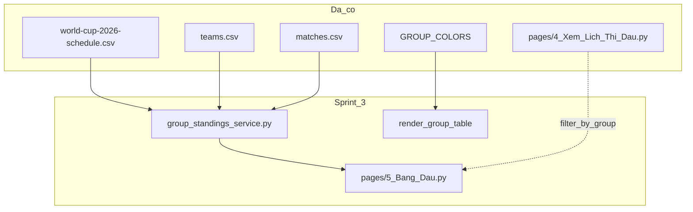

# UI Scorecard — WC 2026 Predictor

Theo dõi chất lượng UI/UX theo góc nhìn senior frontend. Mục tiêu: **10/10** trên mọi tiêu chí, mọi viewport.

---

## Cách chấm điểm

| Thang | Ý nghĩa |
|-------|---------|
| 9–10 | Production-ready, không cần chỉnh thêm |
| 7–8  | Tốt, còn vài điểm polish |
| 5–6  | Dùng được, có bug/UX rõ ràng |
| <5   | Cần refactor |

**Viewport:** Desktop (≥1280px) · Tablet (770–1100px) · iPad portrait / Mobile (≤769px)

---

## Baseline — 2026-06-10 (trước sprint 1)

Audit trang **Dự đoán** (`pages/1_Du_Doan.py`), user U01, card trận đấu.

| Tiêu chí | Desktop | Mobile | Ghi chú |
|----------|---------|--------|---------|
| Visual design | 7.5 | 8.0 | Dark theme ổn, badge/pill tabs đẹp |
| Information hierarchy | 8.0 | 8.5 | Meta → kickoff → teams → picker → chốt |
| Responsive | **6.5** | 8.5 | Desktop 2 cột: tên đội vỡ giữa chữ |
| Interaction clarity | 7.0 | 7.5 | Nút Lưu cuối form, dễ miss khi scroll |
| **Tổng** | **7.3** | **8.1** | |

### Backlog ưu tiên (baseline)

- [x] P0 — Fix word-break tên đội (desktop 2 cột)
- [x] P1 — Kickoff 2 dòng trên mobile
- [x] P1 — Sticky CTA Lưu + giảm 10 → 5 trận/lần
- [ ] P1 — Nhất quán màu segmented control (focus vs active)
- [ ] P1 — Badge "Đã dự đoán" vs giá trị picker hiện tại
- [ ] P2 — Group label dot màu (đồng bộ trang Lịch thi đấu)
- [ ] P2 — Thứ tự card khi stack 1 cột (0,2,4,1,3) trên iPad
- [ ] P2 — Trang Home CTA polish
- [ ] P2 — Trang Lịch thi đấu (fixture rows)
- [ ] P2 — Trang Bảng xếp hạng
- [x] P3 — Login flow UX *(done Sprint 1.9)*

---

## Sprint 1 — Prediction cards (2026-06-10)

**Phạm vi:** 3 fix đầu từ audit card dự đoán.

| # | Việc | File | Trạng thái |
|---|------|------|------------|
| 1 | Tên đội không vỡ giữa chữ; 1 cột ≤1100px | `assets/style.css` | ✅ Done |
| 2 | Kickoff primary + secondary (2 dòng) | `ui_components.py`, CSS | ✅ Done |
| 3 | Sticky Lưu + max 5 trận | `pages/1_Du_Doan.py`, CSS | ✅ Done |

### Điểm sau Sprint 1

| Tiêu chí | Desktop | Mobile | Δ Desktop | Δ Mobile |
|----------|---------|--------|-----------|----------|
| Visual design | 8.0 | 8.5 | +0.5 | +0.5 |
| Information hierarchy | 8.5 | 8.5 | +0.5 | 0 |
| Responsive | **8.8** | **8.8** | **+2.3** | +0.3 |
| Interaction clarity | **8.5** | **8.5** | **+1.5** | +1.0 |
| **Tổng** | **8.5** | **8.6** | +1.2 | +0.5 |

---

## Sprint 1.5 — iPad portrait fix (2026-06-10)

**Phạm vi:** Bug iPad Mini/Air portrait 768px — letterbox, card clip, cờ/tên vỡ.

| # | Việc | File | Trạng thái |
|---|------|------|------------|
| 1 | Sidebar overlay ≤769px → main full width | `assets/style.css` | ✅ Done |
| 2 | Card không clip; padding sticky Lưu | `assets/style.css` | ✅ Done |
| 3 | Cờ + tên `nowrap` trên tablet | `assets/style.css` | ✅ Done |
| 4 | Login bỏ `st.columns([1,2.2,1])` | `pages/1_Du_Doan.py` | ✅ Done |
| 5 | Verify U01/12345 @ 768px | Playwright + iPad thật | ✅ Done |

**Verify số liệu (768px):** container 768px · card ~667px · sidebar overlay (không chiếm layout)

### Điểm sau Sprint 1.5

| Tiêu chí | Desktop | Tablet | iPad/Mobile |
|----------|---------|--------|-------------|
| Visual design | 8.0 | 8.5 | 8.5 |
| Information hierarchy | 8.5 | 8.5 | 8.5 |
| Responsive | 8.8 | 9.0 | **9.2** |
| Interaction clarity | 8.5 | 8.5 | 8.5 |
| **Tổng** | **8.5** | **8.6** | **8.7** |

---

## Sprint 1.75 — Desktop 2 cột restore (2026-06-10)

### Senior audit — TRƯỚC khi sửa *(regression sau Sprint 1.5)*

> Góc nhìn senior 10 năm · user U01 · PC ~1280px · sidebar open/close

| Vấn đề | Mức | Ghi chú |
|--------|-----|---------|
| Card full-width 1 cột trên desktop | **P0** | Card ~750px — picker/VS bị kéo giãn, mất density |
| Mất layout 2 cột ban đầu | **P0** | `st.columns(2)` bị thay bằng 1 container + CSS grid không match DOM Streamlit |
| CSS grid không hoạt động | P1 | Selector `> div > stVerticalBlock` sai; `display:grid` không apply |
| Sidebar flex reflow | ✅ Giữ | Main co/giãn theo sidebar — ấn tượng, nên giữ |
| iPad 768px | ✅ OK | Full width, 1 card/row — không regress |

**Điểm regression (ước lượng):**

| Tiêu chí | Desktop | Tablet | iPad |
|----------|---------|--------|------|
| Visual design | **7.0** ↓ | 8.5 | 8.5 |
| Responsive | **7.5** ↓ | 9.0 | 9.2 |
| **Tổng** | **7.6** ↓ | 8.6 | 8.7 |

### Fix áp dụng

| # | Việc | File | Trạng thái |
|---|------|------|------------|
| 1 | Khôi phục `st.columns(2)` khi ≥3 trận | `pages/1_Du_Doan.py` | ✅ Done |
| 2 | CSS selector đúng DOM: `stForm > stVerticalBlock > stLayoutWrapper > stHorizontalBlock` | `assets/style.css` | ✅ Done |
| 3 | ≤769px: `flex-direction: column` (1 card/row) | `assets/style.css` | ✅ Done |
| 4 | ≥770px: `flex-direction: row` (2 cột) | `assets/style.css` | ✅ Done |
| 5 | Giữ sidebar overlay ≤769px | `assets/style.css` | ✅ Done |

**Verify số liệu sau fix:**

| Viewport | Card width | Layout | Ghi chú |
|----------|------------|--------|---------|
| 768px | ~667px | 1 cột stack | Sidebar overlay |
| 1280px | ~325px × 2 cột | 2 cột xen kẽ | Khôi phục layout đẹp ban đầu |

### Senior audit — SAU khi sửa

| Tiêu chí | Desktop | Tablet | iPad/Mobile | Nhận xét |
|----------|---------|--------|-------------|----------|
| Visual design | **8.5** | 8.5 | 8.5 | Card density desktop trở lại chuẩn |
| Information hierarchy | 8.5 | 8.5 | 8.5 | 2 cột giúp scan nhanh hơn trên PC |
| Responsive | **9.0** | **9.0** | **9.2** | Breakpoint 769/770 rõ ràng |
| Interaction clarity | 8.5 | 8.5 | 8.5 | Sticky Lưu + sidebar reflow vẫn tốt |
| **Tổng** | **8.6** | **8.6** | **8.7** | |

**Còn thiếu để 10/10:** badge vs picker sync, group dot màu, thứ tự card iPad khi stack (P2), polish toàn app.

---

## Sprint 1.8 — Sidebar overlay ≤1330px (2026-06-10)

**Phạm vi:** Tablet/laptop — main không co/giãn khi mở/đóng sidebar.

| # | Việc | File | Trạng thái |
|---|------|------|------------|
| 1 | Sidebar `position: fixed` overlay ≤1330px | `assets/style.css` | ✅ Done |
| 2 | Main giữ 100% width (không letterbox) | `assets/style.css` | ✅ Done |
| 3 | Backdrop + `wc-sidebar-open` pointer-events | `assets/style.css`, `ui_components.py` | ✅ Done |
| 4 | Toolbar z-index không che nút đóng sidebar | `assets/style.css` | ✅ Done |

**Verify:** PC ~1280px · main width không đổi khi toggle sidebar · sidebar z-index trên toolbar

---

## Sprint 1.85 — Click outside đóng sidebar (2026-06-10)

**Phạm vi:** Bug — click vùng tối ngoài sidebar không đóng menu.

| Vấn đề | Root cause | Fix |
|--------|------------|-----|
| Backdrop click không đóng | JS chạy trong iframe; `btn.click()` không trigger React | Inject script vào `window.top`, gọi `__reactProps.onClick` |
| `body.wc-sidebar-open` không set | Race + wrong document context | `setSidebarOpenClass` trên `html`/`body`/`stApp` |
| Backdrop recreate liên tục | MutationObserver mỗi DOM change | Debounce `syncBackdrop`, giữ backdrop nếu đã có |

| # | Việc | File | Trạng thái |
|---|------|------|------------|
| 1 | Boot script v2 inject main document | `ui_components.py` | ✅ Done |
| 2 | `collapseSidebar()` via React onClick | `ui_components.py` | ✅ Done |
| 3 | Page-change cleanup (backdrop stuck) | `ui_components.py` | ✅ Done |
| 4 | Verify browser @1280px | Cursor browser CDP | ✅ Done |

---

## Sprint 1.9 — Polish sprint (2026-06-10)

**Phạm vi:** Kickoff card, login width, lịch sử dự đoán format.

| # | Việc | File | Trạng thái |
|---|------|------|------------|
| 1 | Kickoff card: bỏ ET + UTC+7 → `02:00 · T6, 12/06` | `ui_components.py`, CSS | ✅ Done |
| 2 | Login form 480px align header card | `assets/style.css` | ✅ Done |
| 3 | History format: `→` plain text (không `**` markdown) | `scoring.py` | ✅ Done |
| 4 | Thống nhất `🤝 Hòa` (có dấu) | `scoring.py` | ✅ Done |
| 5 | History table column widths | `pages/1_Du_Doan.py` | ✅ Done |

**Format lịch sử (sau fix P0+P1):**

```
🇲🇽 Mexico - 🇿🇦 South Africa → 🇿🇦 South Africa thắng
🇺🇸 USA - 🇵🇾 Paraguay → 🤝 Hòa
```

### Điểm sau Sprint 1.9

| Tiêu chí | Desktop | Tablet | iPad/Mobile | Δ Desktop |
|----------|---------|--------|-------------|-----------|
| Visual design | **8.7** | 8.6 | 8.6 | +0.2 |
| Information hierarchy | **8.6** | 8.5 | 8.5 | +0.1 |
| Responsive | **9.0** | **9.0** | **9.2** | 0 |
| Interaction clarity | **9.0** | 8.8 | 8.8 | +0.5 |
| **Tổng** | **8.8** | **8.7** | **8.8** | +0.2 |

**Còn thiếu để 10/10:** badge vs picker sync, group dot màu, thứ tự card iPad stack, visualize bảng đấu (Sprint 3).

---

## Pre-push checklist (2026-06-10)

| Gate | Status | Ghi chú |
|------|--------|---------|
| Unit tests (19) | ✅ | scoring + schedule + team_flags |
| Breaking changes | ✅ | Chỉ UI/CSS/display strings |
| Secrets in diff | ✅ | Không có `.env` |
| Docs sync | ✅ | Scorecard Sprint 1.8–1.9 |
| Manual QA | ✅ | Xem bảng dưới |
| CI | — | Chưa có `.github/workflows` |

### Manual QA (đã verify)

- [x] Sidebar ≤1330px: mở → click vùng tối → đóng
- [x] Login logged-out: header + form ~480px cùng width
- [x] Kickoff card: `02:00 · T6, 12/06` (không ET/UTC+7)
- [x] Lịch sử: format `→` + cờ đội thắng
- [x] Desktop ≥770px: 2 cột cards; ≤769px: 1 cột

**Verdict:** Ready to push (2 commits split).

---

## Tiếp theo (Sprint 2)

- [ ] Badge "Đã dự đoán" sync với picker
- [ ] Group label dot màu trên card dự đoán *(reuse `GROUP_COLORS` — chuẩn bị Sprint 3)*
- [ ] (P2) Thứ tự card tuần tự trên iPad ≤769px
- [x] Commit Sprint 1 + 1.5 + 1.75 + 1.8–1.9
- [ ] Audit trang Lịch thi đấu (scorecard riêng)

---

## Sprint 3+ — Visualize 12 bảng đấu (roadmap)

**Ý tưởng:** Trang/tab hiển thị 12 bảng A–L (4 đội/bảng), bổ sung cho trang Lịch thi đấu (104 trận dạng timeline).

### Infra đã có (~80%)

| Nguồn | Dữ liệu |
|-------|---------|
| `data/teams.csv` | 48 đội + `group_letter` A–L |
| `data/matches.csv` | 72 trận vòng bảng + `real_score_a/b` |
| `schedule_service.py` | `GROUP_COLORS`, `group_label_vn()`, `is_group_stage()` |
| `pages/4_Xem_Lich_Thi_Dau.py` | 104 trận, filter Vòng bảng / Knock-out |

### Cần build

| Phase | Deliverable | Effort |
|-------|-------------|--------|
| 3a | `compute_group_standings()` + unit tests | S |
| 3b | Trang/tab **Bảng đấu** — grid 12 cards, màu theo bảng | M |
| 3c | Live update khi admin nhập KQ; cross-link ↔ Lịch thi đấu | M |
| 3d | Knockout bracket (32 đội) | L |

**Dependency:** Sprint 2 group dot màu nên làm trước 3b để token màu nhất quán toàn app.



---

## Lịch sử điểm (changelog)

| Ngày | Trang / Phạm vi | Desktop | Tablet | iPad/Mobile | Ghi chú |
|------|-----------------|---------|--------|-------------|---------|
| 2026-06-10 | Dự đoán — baseline | 7.3 | — | 8.1 | Audit U01 |
| 2026-06-10 | Dự đoán — sprint 1 | 8.5 | — | 8.6 | Word-break, kickoff 2 dòng, sticky Lưu |
| 2026-06-10 | Dự đoán — sprint 1.5 | 8.5 | 8.6 | 8.7 | iPad letterbox fix, verify U01 @768 |
| 2026-06-10 | Dự đoán — sprint 1.75 regression | **7.6** | 8.6 | 8.7 | 1 cột desktop quá to (tạm thời) |
| 2026-06-10 | Dự đoán — sprint 1.75 fix | **8.6** | 8.6 | 8.7 | Khôi phục 2 cột PC, giữ 1 cột ≤769 |
| 2026-06-10 | Global — sprint 1.8 sidebar overlay | 8.6 | 8.6 | 8.7 | Fixed sidebar ≤1330px |
| 2026-06-10 | Global — sprint 1.85 click-outside | 8.7 | 8.7 | 8.7 | React onClick collapse fix |
| 2026-06-10 | Dự đoán + login — sprint 1.9 | **8.8** | **8.7** | **8.8** | Kickoff, login 480px, history → |

---

## Roadmap UI toàn app (target 10/10)

1. **Dự đoán** — card trận ✅, tabs, lịch sử table ✅ (format `→`)
2. **Lịch thi đấu** — fixture rows ✅, filter toolbar (chưa scorecard)
3. **Bảng đấu** — 12 groups visualize *(Sprint 3 — planned)*
4. **Home** — CTA grid, rules
5. **Bảng xếp hạng** — podium, charts, detail table
6. **Admin** — form density, kickoff display
7. **Global** — sidebar overlay ≤1330px ✅, click-outside ✅, login ✅, typography tokens

---

*Cập nhật file này sau mỗi sprint/task UI. Giữ baseline cũ, thêm dòng changelog mới.*
