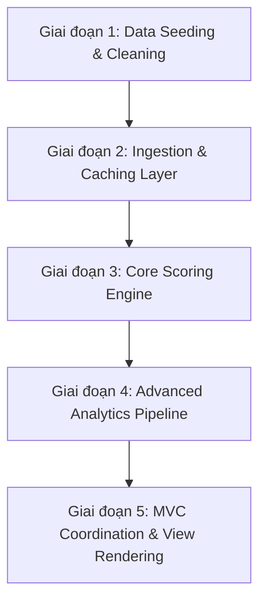
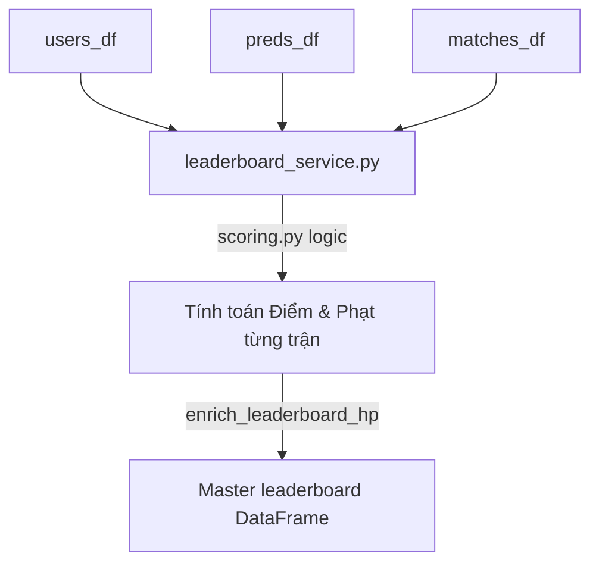
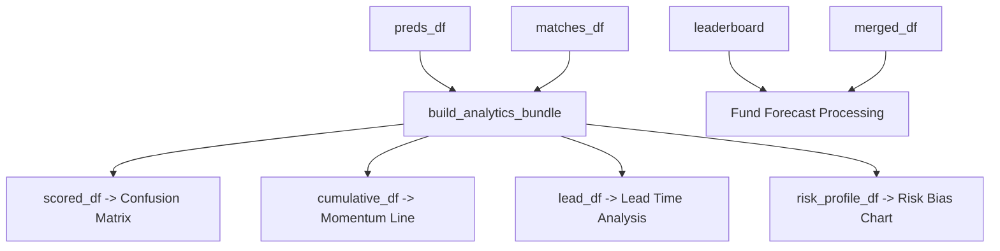

# MASTER ROADMAP
**Dự án:** Hệ thống Tự động hóa Luồng dữ liệu và Báo cáo trực quan (Automated Data Pipeline & Reporting System)  
**Mục tiêu:** Mô tả toàn bộ vòng đời của dữ liệu từ khâu tiền xử lý dữ liệu thô, nạp dữ liệu, tính toán nghiệp vụ cho đến tầng phân tích nâng cao và hiển thị báo cáo.

---

## 🏗️ Sơ đồ Tổng quan Luồng Dữ liệu (Data Pipeline Overview)



---

## 🛠️ Giai đoạn 1: Khởi động & Tiền xử lý dữ liệu (Data Seeding & Cleaning)

Trước khi hệ thống vận hành tự động thông qua giao diện Webapp, dữ liệu tĩnh giải đấu phải trải qua quá trình chuẩn hóa cấu trúc để đồng bộ hệ quy chiếu.

### 1. Quy trình xử lý dữ liệu thô (Môi trường Jupyter Notebook / Scripts)
* **Xử lý giá trị khuyết (Missing Values):** Tỉ số thực tế (`real_score_a`, `real_score_b`) hoặc mã định danh đội đi tiếp (`real_advanced_team_id`) sẽ ở trạng thái trống khi trận đấu chưa diễn ra. Thao tác tiền xử lý thực hiện thay thế chuỗi rỗng bằng giá trị rỗng của hệ thống qua `.replace("", pd.NA)` và ép kiểu số nullable (`Int64`) để tránh làm sai lệch các phép toán tổng hợp.
* **Chuẩn hóa trục thời gian (Timezone):** Dữ liệu lịch thi đấu thô được đồng bộ toàn bộ về múi giờ Việt Nam (`Asia/Ho_Chi_Minh`) thông qua phương thức `pd.to_datetime(..., utc=True)`. Đây là điểm neo kỹ thuật phục vụ logic khóa trận tự động và kiểm tra tính hợp lệ của thời điểm chốt dự đoán.

### 2. Sơ đồ lưu trữ dữ liệu hạt giống (Seed Data)
Hệ thống duy trì các tệp CSV cục bộ trong thư mục `data/` làm nguồn dữ liệu tĩnh và cấu hình nền:
* `data/tournament_stages.csv`: Định nghĩa thứ tự các vòng đấu (`stage_id`, `stage_name`, `stage_order`).
* `data/host_cities.csv`: Danh mục thông tin chi tiết về sân vận động, thành phố và khu vực.
* `data/wc2026_full_players_1200.csv`: Bộ dữ liệu cấu hình thông tin của 1.200 cầu thủ thuộc 48 đội tuyển để phục vụ tính năng tra cứu đội hình.

---

## 📥 Giai đoạn 2: Tầng Kết nối & Đồng bộ (Data Ingestion Layer)

Mọi thao tác đọc/ghi dữ liệu thời gian thực được tập trung xử lý tại module bộ não dữ liệu `data_service.py`.

```mermaid
flowchart LR
    GS[Google Sheets API] -->|gspread.read| DS[data_service.py]
    DS -->|@st.cache_data| PC[Cached DataFrames]
```

### Cơ chế Đọc & Tối ưu bộ nhớ (Caching Mechanism)
Hệ thống sử dụng thư viện `gspread` để thiết lập kết nối đến dịch vụ lưu trữ Google Sheets qua tài khoản dịch vụ (Service Account). Nhằm tối ưu hóa hiệu năng và tránh vượt ngưỡng hạn mức truy vấn API của Google Sheets do đặc thù chạy lại (Rerun) của framework Streamlit, hàm `load_data_for_ranking()` được đóng gói trong decorator `@st.cache_data(ttl=300)` để lưu bộ nhớ đệm trong vòng 5 phút (300 giây).

Dữ liệu nạp về được phân tách thành 4 DataFrame cơ sở (Base DataFrames):
1. `users_df`: Quản lý thông tin tài khoản người dùng (`user_id`, `name`, mật khẩu mã hóa SHA-256).
2. `preds_df`: Ghi nhận dữ liệu dự đoán chi tiết của tất cả người chơi (`user_id`, `match_id`, `pred_outcome`, `timestamp`).
3. `matches_df`: Quản lý lịch thi đấu và kết quả thực tế từ quản trị viên (`match_id`, tỉ số thực tế, trạng thái khóa `is_locked`).
4. `teams_df`: Danh mục mã định danh và cờ quốc gia của 48 đội tuyển phục vụ các phép nối dữ liệu (Join).

---

## 🧠 Giai đoạn 3: Lõi Xử lý Nghiệp vụ & Tính điểm (Core Scoring Engine)

Tầng logic này thay thế hoàn toàn các thao tác tính toán công thức Excel thủ công thông qua sự phối hợp giữa `scoring.py` và `leaderboard_service.py`.



### 1. Logic nghiệp vụ chấm điểm (`scoring.py`)
Hệ thống chuyển đổi kết quả tỉ số số học thành hướng trận đấu được chuẩn hóa: `A` (Đội A thắng), `D` (Hòa), hoặc `B` (Đội B thắng) trước khi so sánh.
* Dự đoán chính xác hướng kết quả trận đấu: Cộng **3 điểm**.
* Tại vòng loại trực tiếp (`stage_id > 1`), nếu người dùng dự đoán `D` (Hòa) và chọn chính xác đội đi tiếp sau loạt luân lưu (`pred_advanced_team_id == real_advanced_team_id`): Cộng thêm **1 điểm** bonus.
* Dự đoán sai hướng kết quả hoặc bỏ lỡ thời hạn chốt dự đoán: Tính phạt **10.000 VNĐ** vào quỹ chung (lưu trữ dưới dạng hệ số giá trị `10` trong cơ sở dữ liệu).

### 2. Thuật toán tổng hợp Master `leaderboard` DataFrame
Hàm `build_leaderboard_with_dynamics()` tiến hành gom nhóm dữ liệu `groupby("user_id")` để tính toán tổng điểm, tổng số tiền phạt tích lũy, số trận thắng, số trận bỏ lỡ và tỷ lệ chính xác (`hit_rate`) của từng cá nhân. Dữ liệu sau đó được chuyển qua hàm `enrich_leaderboard_hp()` để tính toán sinh lực (Gamification) dựa trên lượng tiền phạt tích lũy theo công thức:

$$hp\_lost = \frac{fines}{FINE\_UNIT\_HP}$$

$$remaining\_hp = \max(0, MAX\_HP - hp\_lost)$$

* Trong đó, ngân sách sinh lực tối đa $MAX\_HP = 104$ (tương ứng quỹ phạt trần 1.040.000 VNĐ). Cứ mỗi đơn vị phạt hệ số 10 (tương đương 10.000 VNĐ) sẽ làm khấu trừ đi 1 HP.

#### 📊 Cấu trúc Schema đầu ra của Master `leaderboard` DataFrame:
| Tên Cột | Kiểu Dữ Liệu | Vai Trò và Ý Nghĩa Hiển Thị |
| :--- | :--- | :--- |
| `user_id` | `str` | Khóa ngoại định danh duy nhất của người chơi. |
| `name` | `str` | Tên hiển thị của thành viên trên bảng danh vọng. |
| `points` | `int` | Tổng số điểm tích lũy dùng để phân định thứ hạng chính thức. |
| `fines` | `int` | Giá trị phạt tích lũy (Hệ số 10 tương ứng với 10k VNĐ). |
| `played` | `int` | Tổng số trận đấu hợp lệ đã tham gia dự đoán. |
| `correct` | `int` | Số lượng trận đấu dự đoán chính xác hướng kết quả. |
| `hit_rate` | `float` | Tỷ lệ dự đoán chính xác (`correct / played * 100`). |
| `rank` | `int` | Thứ hạng số học của người chơi (Xử lý không trùng lặp hạng). |
| `remaining_hp` | `int` | Chỉ số sinh lực còn lại hiển thị trực quan qua thanh máu. |
| `badges` | `list[str]` | Danh sách các danh hiệu được hệ thống cấp phát theo thời gian thực (Runtime). |

---

## 📊 GIAI ĐOẠN 4: TẦNG PHÂN TÍCH HÀNH VI NÂNG CAO (ADVANCED ANALYTICS PIPELINE)

Khi người dùng truy cập Tab "Phân tích dữ liệu hành vi", hệ thống kích hoạt module `analytics_service.py` để xử lý các phép toán thống kê và ma trận phức tạp.



### 1. Các thuật toán biến đổi ma trận thành phần
* **Động lực phát triển (Momentum):** Sử dụng hàm `get_cumulative_scores(scored_df)`. Luồng dữ liệu được sắp xếp theo trình tự thời gian tăng dần (`kickoff_vn`, `match_number`), sau đó áp dụng phép tính tổng tích lũy `groupby("user_id")["points"].cumsum()` để sinh ra cột dữ liệu `cumulative_points` phục vụ cho biểu đồ đường chạy.
* **Ma trận nhầm lẫn (Accuracy):** Sử dụng hàm `get_confusion_matrix(scored_df, user_id)`. Thực hiện phép tính đối sánh chéo `pd.crosstab(actual_outcome, pred_outcome)` và tái cấu trúc chỉ số theo mảng thứ tự chuẩn `("A", "D", "B")` để hiển thị bản đồ nhiệt (Heatmap) về thói quen phán đoán.
* **Thời gian chốt kèo (Lead Time):** Sử dụng hàm `get_prediction_lead_time()`. Đo lường khoảng cách thời gian từ lúc người dùng lưu dự đoán (`timestamp`) đến khi giờ bóng lăn (`kickoff_vn`). Phép toán bắt buộc cấu hình tham số `utc=True` khi chuyển đổi định dạng để đồng bộ múi giờ, tránh lỗi lệch giờ hệ thống.
* **Độ lệch rủi ro (Risk Bias):** Áp dụng lý thuyết trí tuệ đám đông. Hàm `calculate_crowd_consensus()` thống kê số phiếu bầu theo từng trận đấu để định nghĩa lựa chọn của số đông là "Cửa trên". Hệ thống đối chiếu lựa chọn của từng cá nhân để phân loại hành vi đặt cược thành hai nhóm: An toàn (Safe) hoặc Mạo hiểm (Risky).

### 2. Mô hình dự báo tài chính (Fund Forecast Engine)
Module này kết hợp mô hình xác suất toán học **Giá trị kỳ vọng (Expected Value - EV)** và thuật toán độ lệch chuẩn tài chính để dự đoán tổng ngân sách tiền phạt thu về khi kết thúc giải đấu.

Công thức toán học tính toán giá trị kỳ vọng về số tiền phạt phát sinh trong tương lai của từng người chơi dựa trên phong độ hiện tại được xác định như sau:

$$Projected\_Future\_Fine_{user} = (1.0 - \frac{hit\_rate}{100.0}) \times remaining\_matches \times 10.000 \text{ VNĐ}$$

Hệ thống tiến hành tổng hợp toàn bộ các kịch bản cá nhân, lấy độ lệch chuẩn (`.std()`) về lượng tiền phạt hiện tại trong nhóm để thiết lập biên độ an toàn tài chính:

$$margin = \max(projected\_total \times 0.15, std\_dev \times 1.5)$$

Hàm `calculate_advanced_forecast()` xử lý thuật toán và trả ra cấu trúc phân tầng gồm 3 kịch bản cốt lõi cung cấp cho biểu đồ quạt (Fan Chart):
* `lower`: Kịch bản cận dưới (Tổng tiền phạt tối thiểu nếu nhóm chơi đột ngột tăng mạnh tỷ lệ đoán trúng).
* `mid`: Kịch bản giá trị kỳ vọng trung bình thực tế nhất dựa trên xu hướng dữ liệu quá khứ.
* `upper`: Kịch bản cận trên (Nguy cơ bùng nổ tiền phạt nếu nhóm chơi liên tục dự đoán sai).

---

## 🔗 GIAI ĐOẠN 5: TẦNG ĐIỀU PHỐI & HIỂN THỊ (MVC COORDINATION & RENDERING)

Giai đoạn cuối cùng thực hiện lắp ráp và điều phối luồng thông tin giữa Tầng Dữ liệu nghiệp vụ và Tầng Hiển thị Giao diện tại tệp Controller chính `pages/3_Bang_Xep_Hang.py`.

1. **Vai trò của Controller:** Thực hiện gọi các hàm nạp dữ liệu đệm từ `data_service.py` -> Truyền tham số qua các dịch vụ tính toán (`leaderboard_service.py`, `analytics_service.py`) -> Đóng gói đầu ra thành một gói dữ liệu tập trung (Bundle).
2. **Vai trò của View (`ui_components.py`):** Tiếp nhận gói dữ liệu Bundle từ Controller gửi sang. Nhằm đảm bảo tính nhất quán của giao diện Chế độ tối (Dark Mode), tệp View tuân thủ nghiêm ngặt quy tắc không sử dụng các cấu trúc widget hiển thị có sẵn của Streamlit. Toàn bộ các bảng vàng, thẻ thông tin (Stat Cards) và sơ đồ được biên dịch trực tiếp sang mã HTML/CSS nguyên bản thông qua hàm wrapper chuyên dụng `_html()` trước khi tiêm lên màn hình trình duyệt của người dùng.