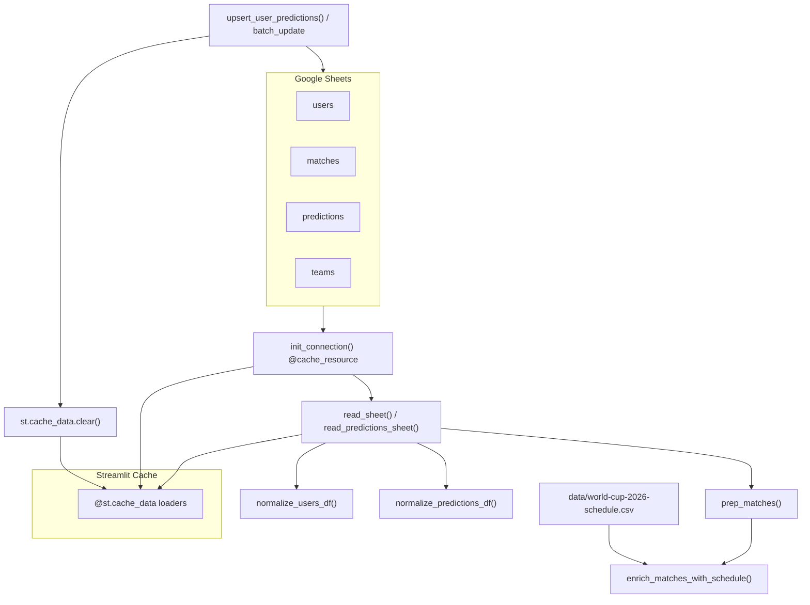

# Luồng Dữ liệu & Cấu trúc

> Walkthrough code: từ Google Sheets I/O → Pandas transformation → cache Streamlit.  
> Tham chiếu: [`PROJECT_CONTEXT.md`](../../PROJECT_CONTEXT.md) · Hub chính: [`data_service.py`](../../data_service.py) · Lịch FIFA: [`schedule_service.py`](../../schedule_service.py)

---

## Tổng quan luồng



---

## Bước 1: Khởi tạo kết nối — `init_connection()`

Khi bất kỳ page nào cần đọc Sheet, luồng đầu tiên gọi `init_connection()` trong [`data_service.py`](../../data_service.py):

```74:85:data_service.py
@st.cache_resource
def init_connection():
    scopes = [
        "https://www.googleapis.com/auth/spreadsheets",
        "https://www.googleapis.com/auth/drive",
    ]
    creds = Credentials.from_service_account_info(
        st.secrets["gcp_service_account"],
        scopes=scopes,
    )
    client = gspread.authorize(creds)
    return client.open_by_key(st.secrets["spreadsheet_id"])
```

**Giải thích từng dòng logic:**

1. Decorator `@st.cache_resource` — Streamlit cache **một lần duy nhất** trong suốt session trình duyệt. Object `gspread` client và spreadsheet handle được tái sử dụng, tránh authorize lại mỗi lần rerun.
2. `Credentials.from_service_account_info(...)` — đọc JSON service account từ `st.secrets["gcp_service_account"]`, gắn scope spreadsheets + drive.
3. `gspread.authorize(creds)` — tạo client gspread.
4. `client.open_by_key(spreadsheet_id)` — trả về đối tượng Spreadsheet để các hàm sau gọi `.worksheet("users")`, v.v.

**Lưu ý:** Đây là **duy nhất** chỗ dùng `@st.cache_resource`. Mọi loader DataFrame dùng `@st.cache_data` (TTL 300s hoặc 3600s).

---

## Bước 2: Đọc Sheet generic — `read_sheet()`

```88:98:data_service.py
def read_sheet(sh, sheet_name: str) -> pd.DataFrame:
    try:
        data = sh.worksheet(sheet_name).get_all_values()
    except gspread.exceptions.WorksheetNotFound:
        return pd.DataFrame()
    if not data or not data[0]:
        return pd.DataFrame()
    headers = [str(h).strip() for h in data[0]]
    if len(data) == 1:
        return pd.DataFrame(columns=headers)
    return pd.DataFrame(data[1:], columns=headers)
```

**Luồng thực thi:**

1. `worksheet.get_all_values()` — trả về `list[list[str]]` toàn bộ tab (mọi cell là string).
2. Hàng 0 = header → `pd.DataFrame(data[1:], columns=headers)`.
3. Tab không tồn tại → DataFrame rỗng (không crash app).

Hàm này được dùng cho tab `users`, `matches`, `teams` — **không** dùng trực tiếp cho `predictions` (tab đó có logic đặc biệt).

---

## Bước 3: Đọc predictions — `read_predictions_sheet()`

Tab `predictions` trên Sheet đôi khi **thiếu header** hoặc header bị lệch. Do đó không dùng `read_sheet()` thuần.

### 3.1. Phát hiện offset header — `_predictions_header_offset()`

```61:71:data_service.py
def _predictions_header_offset(data: list[list]) -> int:
    """Return 0 if first row is data; 1 if first row is the header."""
    if not data:
        return 0
    if _normalize_header_row(data[0]) == list(PREDICTIONS_COLUMNS):
        return 1
    if _row_looks_like_prediction(data[0]):
        return 0
    if len(data) > 1 and _row_looks_like_prediction(data[1]):
        return 1
    return 1
```

- Trả về `0` nếu hàng đầu đã là dữ liệu (`U01`, `42`, …).
- Trả về `1` nếu hàng đầu là header chuẩn `PREDICTIONS_COLUMNS`.
- Heuristic `_row_looks_like_prediction()` kiểm tra cột 0–1 không phải tên cột.

### 3.2. Parse và normalize

```403:424:data_service.py
def read_predictions_sheet(sh) -> pd.DataFrame:
    data = sh.worksheet("predictions").get_all_values()
    ...
    offset = _predictions_header_offset(data)
    records = []
    for row in data[offset:]:
        padded = list(row) + [""] * len(PREDICTIONS_COLUMNS)
        padded = padded[: len(PREDICTIONS_COLUMNS)]
        if _row_looks_like_prediction(padded):
            records.append(padded)

    df = pd.DataFrame(records, columns=list(PREDICTIONS_COLUMNS))
    return normalize_predictions_df(df)
```

Cột chuẩn (`PREDICTIONS_COLUMNS` L15): `user_id`, `match_id`, `pred_outcome`, `pred_advanced_team_id`, `timestamp`.

---

## Bước 4: Chuẩn hóa Users — `normalize_users_df()`

```310:343:data_service.py
def normalize_users_df(users_df: pd.DataFrame) -> pd.DataFrame:
    ...
    df["user_id"] = df["user_id"].astype(str)
    df["name"] = df["name"].astype(str)
    df["password"] = df["password"].astype(str)
    ...
    parsed = _parse_active_from_kickoff(active_raw.loc[has_active].astype(str))
    ...
    return df[list(USERS_COLUMNS)]
```

**Các phép biến đổi Pandas quan trọng:**

| Thao tác | Mục đích |
|----------|----------|
| `df.replace("", pd.NA)` | Chuỗi rỗng Sheet → NaN |
| `.astype(str)` trên `user_id` | Tránh lỗi merge int vs str |
| `_parse_active_from_kickoff()` | `pd.to_datetime` → `tz_localize(VN_TZ)` cho người vào muộn |

Hàm `_parse_active_from_kickoff()` (L303–307): nếu datetime naive → localize `Asia/Ho_Chi_Minh`; nếu đã có tz → convert sang VN.

---

## Bước 5: Chuẩn hóa Predictions — `normalize_predictions_df()`

```366:400:data_service.py
def normalize_predictions_df(preds_df: pd.DataFrame) -> pd.DataFrame:
    from scoring import normalize_pred_outcome, scores_to_outcome
    ...
    if "pred_score_a" in df.columns and "pred_score_b" in df.columns:
        df["pred_outcome"] = df.apply(_legacy_outcome, axis=1)
    else:
        df["pred_outcome"] = df["pred_outcome"].apply(normalize_pred_outcome)

    df["user_id"] = df["user_id"].astype(str)
    df["match_id"] = df["match_id"].astype(str)
    ...
    return df[list(PREDICTIONS_COLUMNS)]
```

### 5.1. `normalize_pred_outcome()` — nằm trong [`scoring.py`](../../scoring.py)

```36:42:scoring.py
def normalize_pred_outcome(value) -> str | None:
    if value is None or (isinstance(value, float) and pd.isna(value)):
        return None
    text = str(value).strip().upper()
    if text in OUTCOMES:
        return text
    return LEGACY_OUTCOME_MAP.get(text)
```

- Chuẩn: `A` / `D` / `B`.
- Legacy từ Sheet cũ: `W`→`A`, `L`→`B`.
- Import **lazy** trong `normalize_predictions_df` để tránh circular import.

### 5.2. Legacy path

Nếu Sheet còn cột `pred_score_a`, `pred_score_b` (format cũ), hàm `_legacy_outcome` gọi `scores_to_outcome(sa, sb)` qua `.apply(axis=1)` để suy ra A/D/B.

---

## Bước 6: Chuẩn bị Matches — `prep_matches()`

Đây là hàm biến đổi **phức tạp nhất** trong pipeline đọc.

```228:290:data_service.py
def prep_matches(matches_raw: pd.DataFrame, teams_df: pd.DataFrame) -> pd.DataFrame:
    matches_raw = matches_raw.copy()
    matches_raw.replace("", pd.NA, inplace=True)

    if "id" in matches_raw.columns and "match_id" not in matches_raw.columns:
        matches_raw.rename(columns={"id": "match_id"}, inplace=True)
    ...
    matches_raw["home_team_id"] = pd.to_numeric(...).astype(pd.Int64Dtype()).astype(str)
    matches_raw["away_team_id"] = pd.to_numeric(...).astype(pd.Int64Dtype()).astype(str)
```

### 6.1. Chuỗi biến đổi theo thứ tự

| # | Thao tác | Chi tiết |
|---|----------|----------|
| 1 | `.replace("", pd.NA)` | Rỗng → NaN |
| 2 | Rename `id` → `match_id` | Bảo vệ primary key |
| 3 | Bổ sung cột thiếu | `real_score_a/b`, `real_advanced_team_id`, `is_locked` |
| 4 | Parse `is_locked` | `.astype(str).str.upper() == "TRUE"` → bool |
| 5 | Ép team ID | `pd.to_numeric` → `Int64` → `.astype(str)` (an toàn NaN) |
| 6 | **Merge lần 1** | `pd.merge(matches_raw, teams_df, left_on="home_team_id", right_on="id", how="left")` → `team_a`, `team_a_fifa` |
| 7 | **Merge lần 2** | Tương tự cho `away_team_id` → `team_b`, `team_b_fifa` |
| 8 | Fillna | `team_a/b` → `"TBD"`, fifa → `""` |
| 9 | `stage_id` | `pd.to_numeric(...).fillna(1).astype(int)` |
| 10 | Gọi schedule | `enrich_matches_with_schedule(matches_df)` |

Sau merge, cột `id` của bảng teams bị `.drop(columns=["id"])` để tránh trùng tên.

---

## Bước 7: Enrich lịch FIFA — `schedule_service.py`

### 7.1. Load CSV lịch chính thức — `load_wc_schedule()`

```45:69:schedule_service.py
def load_wc_schedule(path: Path | None = None) -> pd.DataFrame:
    df = pd.read_csv(csv_path)
    df = df.rename(columns={"Match": "match_number", "Date (UTC)": "date_utc", ...})
    df["match_number"] = pd.to_numeric(df["match_number"], errors="coerce").astype("Int64")
    df["kickoff_utc"] = df.apply(lambda r: _parse_kickoff_utc(...), axis=1)
    df["kickoff_vn"] = df["kickoff_utc"].dt.tz_convert(VN_TZ)
    df["kickoff_vn_date"] = df["kickoff_vn"].dt.date
    df["venue_line"] = df["Venue"].astype(str) + " · " + df["City"].astype(str)
    return df
```

File nguồn: `data/world-cup-2026-schedule.csv` — 104 trận với kickoff UTC, ET, venue.

### 7.2. Merge vào matches — `enrich_matches_with_schedule()`

```247:284:schedule_service.py
def enrich_matches_with_schedule(matches_df, schedule_df=None):
    schedule = schedule_df if schedule_df is not None else load_wc_schedule()
    sched = schedule[schedule_cols].copy()
    sched["match_number"] = sched["match_number"].astype(int)

    merged = matches_df.copy()
    merged["match_number"] = pd.to_numeric(merged["match_number"], errors="coerce").astype(int)
    merged = merged.merge(sched, on="match_number", how="left", suffixes=("", "_sched"))

    if "kickoff_at" in merged.columns:
        fallback = pd.to_datetime(merged["kickoff_at"], errors="coerce")
        fallback = fallback.dt.tz_localize(VN_TZ)  # nếu naive
        merged["kickoff_vn"] = merged["kickoff_vn"].fillna(fallback)

    merged["kickoff_at"] = merged["kickoff_vn"].apply(kickoff_vn_storage_value)
    return merged.sort_values(["kickoff_vn", "match_number"], na_position="last").reset_index(drop=True)
```

**Kết quả:** Mỗi trận có `kickoff_vn` (tz-aware UTC+7), `group_round`, `Venue`, `City`, `venue_line`. Cột `kickoff_at` bị **ghi đè** format chuẩn `YYYY-MM-DD HH:MM` để đồng bộ với Sheet.

---

## Bước 8: Pattern cache trên các page

### 8.1. Ví dụ loader trang Dự đoán

```75:87:pages/1_Du_Doan.py
@st.cache_data(ttl=300, show_spinner=False)
def load_and_prep_data():
    sh = init_connection()
    users_df = normalize_users_df(read_sheet(sh, "users"))
    preds_df = read_predictions_sheet(sh)
    matches_raw = read_sheet(sh, "matches")
    teams_df = read_sheet(sh, "teams")
    matches_raw.replace("", pd.NA, inplace=True)
    matches_df = prep_matches(matches_raw, teams_df)
    return users_df, matches_df, preds_df, teams_df
```

**TTL 300 giây** — trong 5 phút, Streamlit không gọi lại Google Sheets khi user rerun page.

### 8.2. Bảng tất cả `@st.cache_data` trong project

| File | Hàm | TTL |
|------|-----|-----|
| `1_Du_Doan.py` | `load_and_prep_data` | 300s |
| `1_Du_Doan.py` | `load_players_for_pred` | 3600s |
| `2_Lich_Thi_Dau.py` | `load_matches_data` | 300s |
| `2_Lich_Thi_Dau.py` | `load_matrix_data` | 300s |
| `2_Lich_Thi_Dau.py` | `load_achievements_admin` | 300s |
| `3_Bang_Xep_Hang.py` | `load_data_for_ranking` | 300s |
| `3_Bang_Xep_Hang.py` | `load_achievements_rules` | 300s |
| `3_Bang_Xep_Hang.py` | `load_lb_sidebar_bundle` | 300s |
| `3_Bang_Xep_Hang.py` | `build_analytics_bundle` | 300s |
| `4_Xem_Lich_Thi_Dau.py` | `load_matches_data` | 300s |
| `5_Bang_Dau.py` | `load_data` | 300s |
| `6_Bracket_Knockout.py` | `load_data` | 300s |
| `7_Tra_Cuu_Doi_Bong.py` | `load_squad_data` | 3600s |

---

## Bước 9: Vòng lặp đồng bộ — ghi Sheet và invalidate cache

### 9.1. User lưu dự đoán

Luồng trong [`pages/1_Du_Doan.py`](../../pages/1_Du_Doan.py) L286–332:

1. User bấm `st.button("💾 Lưu tất cả dự đoán đã chốt")` → `submitted = True`. Không dùng `st.form` — outcome picker rerun ngay khi đổi A/D/B để ẩn/hiện PEN picker.
2. **Re-read matches không qua cache** — `init_connection()` + `ws_matches.get_all_values()` để kiểm tra lock realtime.
3. Build `entries`: `outcome_norm = normalize_pred_outcome(outcome)`; `adv_id` chỉ set khi `is_ko and outcome_norm == "D" and adv_t != "TBD"`, ngược lại `""`.
4. `upsert_user_predictions(ws_preds, user_id, entries)` — ghi Sheet.
5. `st.cache_data.clear()` — xóa **toàn bộ** cache data của session.
6. `st.rerun()` — reload page với dữ liệu mới.

### 9.2. Hàm ghi — `upsert_user_predictions()`

```451:486:data_service.py
def upsert_user_predictions(ws, user_id, entries):
    data = ws.get_all_values()
    offset = _predictions_header_offset(data)
    existing_rows: dict[tuple[str, str], int] = {}
    for i, row in enumerate(data[offset:], start=offset + 1):
        existing_rows[(str(row[0]).strip(), str(row[1]).strip())] = i

    for match_id, outcome, adv_id, ts in entries:
        pred_row = [uid, str(match_id), outcome or "", adv_id or "", ts or ""]
        key = (uid, str(match_id))
        if key in existing_rows:
            updates.append({"range": f"A{row_idx}:E{row_idx}", "values": [pred_row]})
        else:
            new_rows.append(pred_row)

    if updates:
        ws.batch_update(updates)
    if new_rows:
        ws.append_rows(new_rows, value_input_option="USER_ENTERED")
```

**Không dùng Pandas** — thao tác trực tiếp qua gspread API. Key upsert: `(user_id, match_id)`.

### 9.3. Admin cập nhật tỉ số / khóa trận

Trong [`pages/2_Lich_Thi_Dau.py`](../../pages/2_Lich_Thi_Dau.py), hàm `_apply_admin_updates()` (L147–189):

1. `init_connection()` → đọc raw `matches` sheet vào `raw_df`.
2. Mutate cột tương ứng (`real_score_a/b`, `is_locked`, …).
3. `ws_matches.batch_update(updates)` — ghi từng hàng.
4. `st.cache_data.clear()` + `st.rerun()`.

### 9.4. Các trigger invalidate cache khác

| Sự kiện | File | Hành động |
|---------|------|-----------|
| Lưu dự đoán | `1_Du_Doan.py:316` | `st.cache_data.clear()` |
| Admin score/lock | `2_Lich_Thi_Dau.py:188` | `st.cache_data.clear()` |
| Push ma trận | `2_Lich_Thi_Dau.py:563` | `load_matrix_data.clear()` (targeted) |
| Thêm user | `2_Lich_Thi_Dau.py:521` | `st.cache_data.clear()` |
| CRUD achievement | `2_Lich_Thi_Dau.py:677,733` | `load_achievements_admin.clear()` + global clear |
| Đổi tên/mật khẩu | `ui_components.py:2017,2036` | `st.cache_data.clear()` |

Page read-only (Lịch thi đấu, Bảng đấu, Bracket) **không** tự invalidate — chỉ hết hạn sau TTL 300s hoặc khi page khác gọi `clear()`.

---

## Bước 10: Luồng đọc end-to-end (ví dụ BXH)

```
pages/3_Bang_Xep_Hang.py
  load_data_for_ranking()  [@st.cache_data ttl=300]
    → init_connection()    [@st.cache_resource]
    → normalize_users_df(read_sheet("users"))
    → read_predictions_sheet(sh)
         → get_all_values("predictions")
         → _predictions_header_offset()
         → pd.DataFrame → normalize_predictions_df()
    → read_sheet("matches"), read_sheet("teams")
    → prep_matches(matches_raw, teams_df)
         → pd.merge teams ×2
         → enrich_matches_with_schedule()
              → load_wc_schedule() → pd.merge on match_number
```

Sau khi có 4 DataFrame chuẩn, controller gọi `leaderboard_service.build_leaderboard_with_dynamics()` — xem [`02_Gamification_Scoring_Flow.md`](02_Gamification_Scoring_Flow.md).

---

## Tóm tắt quy tắc ép kiểu (bắt buộc)

| Cột | Quy tắc |
|-----|---------|
| `user_id`, `match_id` | Luôn `.astype(str)` trước merge/groupby |
| `points`, `fines` | `pd.to_numeric(..., errors="coerce").fillna(0)` |
| `kickoff_vn`, `timestamp` | `pd.to_datetime(..., format="mixed", errors="coerce", utc=True)` khi trừ datetime |
| `is_locked` | Sheet `"TRUE"` → Python `bool` |

Vi phạm quy tắc này gây lỗi `TypeError: Cannot subtract tz-naive and tz-aware` hoặc merge sai key.
