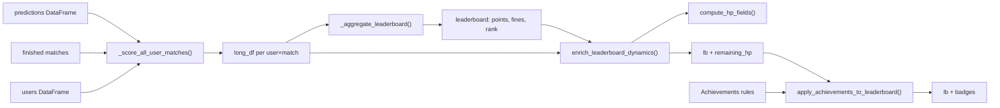

# Luồng Tính Điểm & Hệ thống HP

> Walkthrough code: từ raw predictions → join kết quả thật → HP → BXH → badge.  
> Tham chiếu: [`PROJECT_CONTEXT.md`](../../PROJECT_CONTEXT.md) · Entry controller: [`pages/3_Bang_Xep_Hang.py`](../../pages/3_Bang_Xep_Hang.py)

---

## Tổng quan pipeline gamification



---

## Phần 1: Logic chấm điểm cơ bản — `scoring.py`

### 1.1. Chuẩn hóa outcome — `normalize_pred_outcome()`

```36:42:scoring.py
def normalize_pred_outcome(value) -> str | None:
    if value is None or (isinstance(value, float) and pd.isna(value)):
        return None
    text = str(value).strip().upper()
    if text in OUTCOMES:
        return text
    return LEGACY_OUTCOME_MAP.get(text)
```

Mọi hàm tính điểm/phạt đều gọi hàm này trước. Outcome hợp lệ: `A` (Đội A thắng), `D` (Hòa), `B` (Đội B thắng).

### 1.2. Suy outcome từ tỉ số — `scores_to_outcome()`

```28:33:scoring.py
def scores_to_outcome(score_a: int, score_b: int) -> str:
    if score_a > score_b:
        return "A"
    if score_a < score_b:
        return "B"
    return "D"
```

Dùng khi so sánh `real_score_a` vs `real_score_b` từ Sheet.

### 1.3. Tính điểm — `calculate_points(row)`

```70:87:scoring.py
def calculate_points(row) -> int:
    try:
        real_a, real_b = _parse_int(row["real_score_a"]), _parse_int(row["real_score_b"])
        pred_outcome = normalize_pred_outcome(row.get("pred_outcome"))
        if pred_outcome is None:
            return 0
    except (KeyError, TypeError):
        return 0

    real_outcome = scores_to_outcome(real_a, real_b)
    points = 3 if pred_outcome == real_outcome else 0
    stage = _parse_stage(row)

    if stage > 1 and real_outcome == "D" and pred_outcome == "D":
        pred_adv, real_adv = row.get("pred_advanced_team_id"), row.get("real_advanced_team_id")
        if _clean_team_id(pred_adv) and _clean_team_id(real_adv) and _clean_team_id(pred_adv) == _clean_team_id(real_adv):
            points += 1
    return points
```

**Công thức toán học:**

| Tình huống | Điểm |
|------------|------|
| Dự đoán đúng outcome (A/D/B) | **+3** |
| Knock-out (`stage_id > 1`), hòa thật, dự đoán hòa, **đúng đội đi tiếp PEN** | **+1** (tổng **4**) |
| Sai outcome hoặc không có dự đoán | **0** |

Hàm nhận một `row` (dict/Series đã merge prediction + match).

> **UI thu thập `pred_advanced_team_id`:** Trang dự đoán chỉ hiện PEN picker khi user chọn Hòa ở knock-out — xem [`03_User_Interaction_Flow.md`](03_User_Interaction_Flow.md) Phần 4.4.

### 1.4. Tính phạt — `calculate_fines(row)`

```90:99:scoring.py
def calculate_fines(row) -> int:
    try:
        real_a, real_b = _parse_int(row["real_score_a"]), _parse_int(row["real_score_b"])
        pred_outcome = normalize_pred_outcome(row.get("pred_outcome"))
        if pred_outcome is None:
            return 10
    except (KeyError, TypeError):
        return 10

    return 0 if pred_outcome == scores_to_outcome(real_a, real_b) else 10
```

**Đơn vị:** `10` trong cột `fines` = **10.000 VNĐ**. Đúng → `0`; sai hoặc thiếu pred → `10`.

---

## Phần 2: Gộp prediction + match — `leaderboard_service.py`

### 2.1. Chấm từng trận — `score_finished_match()`

```45:50:leaderboard_service.py
def score_finished_match(pred_row: pd.Series | None, match_row: pd.Series) -> tuple[int, int, bool]:
    if pred_row is None or normalize_pred_outcome(pred_row.get("pred_outcome")) is None:
        return 0, FINE_MISSED_MATCH, False
    merged = {**match_row.to_dict(), **pred_row.to_dict()}
    return calculate_points(merged), calculate_fines(merged), True
```

- Không có dự đoán → `(0 điểm, 10 phạt, has_pred=False)`.
- Có dự đoán → merge 2 Series thành dict, gọi `calculate_points` + `calculate_fines`.

`FINE_MISSED_MATCH = 10` (L10) — phạt bỏ lỡ trận.

### 2.2. Form code — `_form_code()`

```28:31:leaderboard_service.py
def _form_code(has_pred: bool, pts: int) -> str:
    if not has_pred:
        return "D"
    return "W" if pts >= 3 else "L"
```

| Code | Ý nghĩa | Emoji UI |
|------|---------|----------|
| `W` | Thắng (≥3 điểm) | ✅ |
| `L` | Thua (sai) | ❌ |
| `D` | Bỏ lỡ / missed | ➖ |

---

## Phần 3: DataFrame timeline — `_score_all_user_matches()`

Hàm này tạo **`long_df`**: một hàng cho mỗi cặp `(user, trận đã kết thúc eligible)`.

```73:120:leaderboard_service.py
def _score_all_user_matches(users_df, preds_df, finished_matches_df) -> pd.DataFrame:
    users["user_id"] = users["user_id"].astype(str)
    finished = _build_global_finished_order(finished_matches_df)
    pred_by_key = _pred_lookup(preds)

    for _, user in users.iterrows():
        user_finished = eligible_finished_matches(finished, user)
        for _, match in user_finished.iterrows():
            pred = pred_by_key.get((uid, m_id))
            pts, fine, has_pred = score_finished_match(pred, match)
            rows.append({...})

    long_df["cum_pts"] = long_df.groupby("user_id")["match_pts"].cumsum()
    long_df["cum_fines"] = long_df.groupby("user_id")["match_fines"].cumsum()
```

### 3.1. Cột output `long_df`

| Cột | Nguồn |
|-----|-------|
| `user_id`, `name` | users |
| `global_order` | thứ tự trận toàn giải (1..N) |
| `match_date_vn` | `kickoff_vn.date()` |
| `match_pts` | `calculate_points` |
| `match_fines` | `calculate_fines` hoặc 10 nếu missed |
| `has_pred` | bool |
| `form_code` | W/L/D |
| `cum_pts`, `cum_fines` | `groupby("user_id").cumsum()` |

### 3.2. Eligibility — `user_service.eligible_finished_matches()`

Người vào muộn (`active_from_kickoff`) chỉ tính trận từ kickoff đó trở đi. Hàm lọc trước khi loop user×match.

---

## Phần 4: Aggregate BXH — `_aggregate_leaderboard()`

```123:224:leaderboard_service.py
def _aggregate_leaderboard(long_df, users_df) -> pd.DataFrame:
    agg = long_df.groupby('user_id', as_index=False).agg(
        points=('match_pts', 'sum'),
        fines=('match_fines', 'sum'),
        played=('has_pred', 'sum'),
        total_finished=('global_order', 'count')
    )
    correct = long_df[long_df['match_pts'] >= 3].groupby('user_id').size()
    missed = long_df[~long_df['has_pred']].groupby('user_id').size()
    ...
    lb['hit_rate'] = lb.apply(lambda r: round(r['correct'] / r['played'] * 100, 1) if r['played'] > 0 else 0.0, axis=1)
    lb = lb.sort_values(by=sort_cols, ascending=asc_orders)
    lb['rank'] = lb.index + 1
```

### 4.1. Thuật toán xếp hạng (unique — không hòa hạng)

Sort giảm dần trừ `name`:

1. `points` ↓
2. `current_streak` ↓ (chuỗi W gần nhất; số dương = thắng liên tiếp)
3. `hit_rate` ↓
4. `name` ↑ (A→Z tie-break cuối)

Sau sort: `rank = index + 1` — **luôn unique** 1, 2, 3, …

### 4.2. Tính `current_streak`

```152:166:leaderboard_service.py
for uid, group in long_df.groupby('user_id'):
    codes = group.sort_values('global_order')['form_code'].tolist()
    streak = 0
    if codes:
        last_code = codes[-1]
        if last_code == 'W':
            for c in reversed(codes):
                if c == 'W': streak += 1
                else: break
        elif last_code == 'L':
            for c in reversed(codes):
                if c == 'L': streak -= 1
                else: break
```

- Chuỗi thắng: đếm `W` liên tiếp từ cuối → số **dương**.
- Chuỗi thua: đếm `L` liên tiếp → số **âm**.
- Kết thúc bằng `D` (missed) → streak = 0.

---

## Phần 5: Dynamics & HP — `build_leaderboard_with_dynamics()`

```357:366:leaderboard_service.py
def build_leaderboard_with_dynamics(users_df, preds_df, finished_matches_df):
    long_df = _score_all_user_matches(users_df, preds_df, finished_matches_df)
    lb = _aggregate_leaderboard(long_df, users_df)
    snapshots = build_day_end_snapshots(long_df, users_df)
    return enrich_leaderboard_dynamics(lb, long_df, snapshots)
```

### 5.1. Snapshot theo ngày — `build_day_end_snapshots()`

Với mỗi ngày thi đấu, lấy hàng cuối cùng của mỗi user trong `long_df` (cum_pts, cum_fines), sort và gán rank bằng `_competition_rank()` — **cho phép hòa hạng** (khác với BXH chính).

### 5.2. Enrich dynamics — `enrich_leaderboard_dynamics()`

Thêm vào `lb`:

| Cột | Cách tính |
|-----|-----------|
| `rank_movement_delta` | `prev_rank - curr_rank` từ 2 snapshot ngày gần nhất |
| `rank_movement` | `▲ N` / `▼ N` / `➖` |
| `recent_form` | 5 `form_code` gần nhất (list) |
| `recent_form_display` | emoji string |
| `phat_vnd` | `format_fines_vnd(fines)` → `fines * 1000` VNĐ |
| `remaining_hp`, `remaining_hp_pct` | qua `enrich_leaderboard_hp()` |

---

## Phần 6: Hệ thống HP — `achievement_service.py`

### 6.1. Hằng số

```11:12:achievement_service.py
MAX_HP = 104  # 1.040.000 VNĐ budget — 1 HP = 10.000 VNĐ
FINE_UNIT_HP = 10  # fines column stores 10 per 10k VNĐ penalty (10 → 1 HP)
```

### 6.2. `compute_hp_fields(fines_k)`

```132:139:achievement_service.py
def compute_hp_fields(fines_k: int) -> dict[str, int | float]:
    hp_lost = int(fines_k) // FINE_UNIT_HP
    remaining = max(0, MAX_HP - hp_lost)
    return {
        "remaining_hp": remaining,
        "remaining_hp_pct": round(remaining / MAX_HP * 100, 1),
    }
```

**Ví dụ:** `fines = 30` (300k VNĐ) → mất 3 HP → còn **101/104**.

### 6.3. Gắn HP vào BXH — `enrich_leaderboard_hp()`

```462:471:achievement_service.py
def enrich_leaderboard_hp(leaderboard):
    lb = leaderboard.copy()
    hp_cols = lb["fines"].apply(lambda f: pd.Series(compute_hp_fields(int(f))))
    lb["remaining_hp"] = hp_cols["remaining_hp"].astype(int)
    lb["remaining_hp_pct"] = hp_cols["remaining_hp_pct"].astype(float)
    return lb
```

Pandas `.apply()` trên cột `fines` — mỗi hàng gọi `compute_hp_fields()`.

---

## Phần 7: Đánh giá Badge — `evaluate_user_achievements()`

### 7.1. Build stats — `build_user_stats_dict()`

```181:213:achievement_service.py
def build_user_stats_dict(lb_row, streaks=None, per_user_streaks=None):
    fines = int(lb_row.get("fines", 0) or 0)
    hp = compute_hp_fields(fines)
    ...
    return {
        "total_penalties": float(fines),
        "points": float(lb_row.get("points", 0) or 0),
        "hit_rate": hit_rate,
        "correct": float(correct),
        "missed": float(lb_row.get("missed", 0) or 0),
        "played": float(played),
        "remaining_hp": float(hp["remaining_hp"]),
        "win_streak": float(win_streak),
        "lose_streak": float(lose_streak),
    }
```

9 metric khớp với cột rule trên Sheet `Achievements`.

### 7.2. Streak cho badge — `build_per_user_streak_recent()`

```162:173:achievement_service.py
def build_per_user_streak_recent(timeline_df):
    for uid, group in timeline_df.groupby("user_id"):
        codes = group.sort_values("global_order")["form_code"].tolist()
        out[str(uid)] = {
            "win_streak": _trailing_streak_count(codes, {"W"}),
            "lose_streak": _trailing_streak_count(codes, {"L", "D"}),
        }
```

**Khác BXH `current_streak`:** badge `lose_streak` tính cả `D` (bỏ lỡ) như thua.

### 7.3. Engine đánh giá rule

```259:317:achievement_service.py
def evaluate_user_achievements(user_stats, rules_df) -> list[str]:
    for pos, (_, rule) in enumerate(rules_df.iterrows()):
        metric = str(rule.get("metric", "")).strip()
        operator_key = str(rule.get("operator", "")).strip()
        threshold = _coerce_threshold(rule.get("threshold_value"))
        ...
        actual = float(user_stats[metric])
        if OPERATORS[operator_key](actual, threshold):
            matches.append((pos, badge, metric, operator_key, threshold))
```

**Operators** (L14–20): `>`, `>=`, `==`, `<`, `<=` — map tới `operator.gt`, `ge`, `eq`, `lt`, `le`.

**Ví dụ rule:** `metric=correct`, `operator==`, `threshold=5` → badge khi đúng **đúng 5** trận.

### 7.4. Tier exclusivity cho `total_penalties`

```290:315:achievement_service.py
# Chỉ giữ badge tier cao nhất (>=) hoặc thấp nhất (<=) cho total_penalties
if metric in TIER_EXCLUSIVE_METRICS:
    if operator_key in TIER_HIGH_OPERATORS:
        # giữ threshold lớn nhất
    elif operator_key in TIER_LOW_OPERATORS:
        # giữ threshold nhỏ nhất
```

Tránh user nhận đồng thời nhiều badge phạt (50k, 100k, 250k…). Metric khác (points, win_streak…) **stack** tất cả rule match.

### 7.5. Gắn badge vào BXH — `apply_achievements_to_leaderboard()`

```437:459:achievement_service.py
def apply_achievements_to_leaderboard(leaderboard, rules_df, ...):
    lb["badges"] = lb.apply(
        lambda row: evaluate_user_achievements(
            build_user_stats_dict(row.to_dict(), ...),
            rules_df,
        ),
        axis=1,
    )
```

Cột `badges` = `list[str]` tên badge.

---

## Phần 8: Wiring trên controller BXH

Trong [`pages/3_Bang_Xep_Hang.py`](../../pages/3_Bang_Xep_Hang.py) (khoảng L180–218):

```python
leaderboard = build_leaderboard_with_dynamics(users_df, preds_df, finished_matches)
achievements_df = load_achievements_rules()
per_user_streaks = build_per_user_streak_recent(streak_timeline)
leaderboard = apply_achievements_to_leaderboard(
    leaderboard, achievements_df, per_user_streaks=per_user_streaks
)
```

---

## Sơ đồ cột DataFrame end-to-end

```
predictions + finished_matches + users
  │
  ▼ _score_all_user_matches()
long_df: user_id, match_pts, match_fines, has_pred, form_code, cum_pts, cum_fines
  │
  ▼ _aggregate_leaderboard()
lb: points, fines, played, correct, missed, hit_rate, rank, current_streak
  │
  ▼ enrich_leaderboard_dynamics() + enrich_leaderboard_hp()
lb: + rank_movement, recent_form, remaining_hp, remaining_hp_pct, phat_vnd
  │
  ▼ apply_achievements_to_leaderboard()
lb: + badges (list[str])
```

---

## Bảng tra nhanh công thức

| Khái niệm | Công thức |
|-----------|-----------|
| Điểm đúng | 3 |
| Bonus PEN knock-out | +1 (max 4) |
| Phạt sai / bỏ lỡ | 10 (= 10k VNĐ) |
| VNĐ hiển thị | `fines * 1000` |
| HP mất | `fines // 10` |
| HP còn | `max(0, 104 - hp_lost)` |
| Hit rate | `correct / played * 100` |
| Badge check | `OPERATORS[op](actual_metric, threshold)` |
