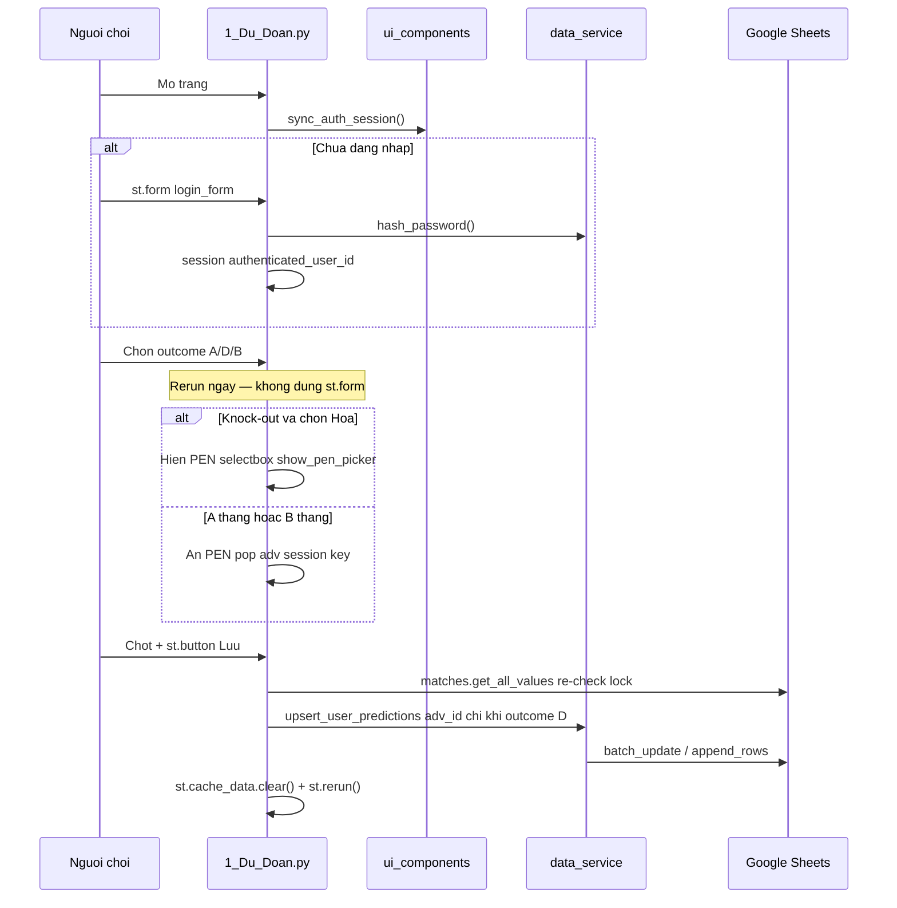
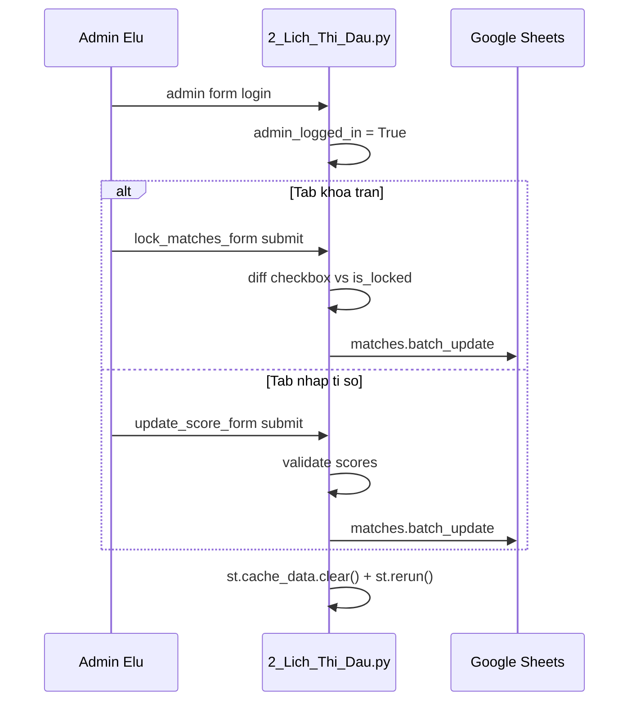

# Luồng Trải nghiệm Người dùng & Admin

> Walkthrough code: auth HMAC, gửi dự đoán, admin khóa trận / nhập tỉ số.  
> Tham chiếu: [`PROJECT_CONTEXT.md`](../../PROJECT_CONTEXT.md) · User: [`pages/1_Du_Doan.py`](../../pages/1_Du_Doan.py) · Admin: [`pages/2_Lich_Thi_Dau.py`](../../pages/2_Lich_Thi_Dau.py)

---

## Tổng quan hai luồng





---

## Phần 1: Auth HMAC — `ui_components.py`

Mọi page gọi `sync_auth_session()` ngay sau `apply_global_styles()`.

### 1.1. Tạo chữ ký — `get_auth_signature()`

```313:316:ui_components.py
def get_auth_signature(user_id: str) -> str:
    secret = st.secrets.get("password_salt", "MuoiMacDinh_@123").encode("utf-8")
    return hmac.new(secret, user_id.encode("utf-8"), hashlib.sha256).hexdigest()
```

Input: `user_id` (ví dụ `"U01"`). Output: hex digest 64 ký tự. Secret = `password_salt` từ `secrets.toml`.

### 1.2. Đồng bộ session — `sync_auth_session()`

```357:380:ui_components.py
def sync_auth_session():
    if "authenticated_user_id" not in st.session_state:
        st.session_state["authenticated_user_id"] = None

    if st.session_state["authenticated_user_id"] is None:
        url_uid = st.query_params.get("uid")
        url_sig = st.query_params.get("sig")
        if url_uid and url_sig:
            expected_sig = get_auth_signature(url_uid)
            if hmac.compare_digest(url_sig, expected_sig):
                st.session_state["authenticated_user_id"] = url_uid
            else:
                st.query_params.clear()

    if st.session_state["authenticated_user_id"] is not None:
        uid = st.session_state["authenticated_user_id"]
        st.query_params["uid"] = uid
        st.query_params["sig"] = get_auth_signature(uid)
```

**Luồng 3 bước:**

1. Khởi tạo `authenticated_user_id` = `None` nếu chưa có.
2. **Restore từ URL** (F5): đọc `uid` + `sig`, verify bằng `hmac.compare_digest` (timing-safe). Sai chữ ký → xóa query params.
3. **Ghi lên URL** nếu đã login — giữ session qua refresh.

**Session keys liên quan:**

| Key | Mục đích |
|-----|----------|
| `authenticated_user_id` | ID người chơi đang login |
| `admin_logged_in` | Gate admin (page 2 only) |
| `chk_reset_counter` | Reset toggle "Chốt" sau save |
| `success_msg_pred` | Toast lưu dự đoán thành công |

**Lưu ý:** Admin auth **tách biệt** — dùng `st.secrets["admin_password"]`, không dùng HMAC user.

---

## Phần 2: Trang Dự đoán — bootstrap

[`pages/1_Du_Doan.py`](../../pages/1_Du_Doan.py) L51–90:

```python
st.set_page_config(page_title="Dự Đoán WC 2026", ...)
apply_global_styles()
sync_auth_session()
render_sidebar()

@st.cache_data(ttl=300)
def load_and_prep_data():
    sh = init_connection()
    users_df = normalize_users_df(read_sheet(sh, "users"))
    preds_df = read_predictions_sheet(sh)
    matches_df = prep_matches(read_sheet(sh, "matches"), read_sheet(sh, "teams"))
    return users_df, matches_df, preds_df, teams_df

users_df, matches_df, preds_df, teams_df = load_and_prep_data()
```

---

## Phần 3: Login người chơi

Nếu `authenticated_user_id` là `None` → render form login và `st.stop()` (L98–126).

```105:122:pages/1_Du_Doan.py
with st.form("login_form"):
    login_id = st.text_input("Tên hiển thị hoặc Mã ID", ...)
    login_pwd = st.text_input("Mật khẩu / Mã PIN", type="password", ...)
    submit_login = st.form_submit_button("🔓 Đăng nhập hệ thống", ...)

    if submit_login:
        user_match = users_df[(users_df["name"] == login_id_clean) | (users_df["user_id"] == login_id_clean)]
        if user_match.empty:
            st.error("❌ Tên đăng nhập không tồn tại!")
        else:
            stored_password_hash = str(user_match["password"].values[0]).strip()
            if hash_password(login_pwd.strip()) == stored_password_hash or login_pwd.strip() == stored_password_hash:
                st.session_state["authenticated_user_id"] = str(user_match["user_id"].values[0])
                st.rerun()
            else:
                st.error("❌ Sai mật khẩu!")
```

**Validation:**

1. Match theo `name` **hoặc** `user_id`.
2. So sánh `hash_password(pwd)` với cột `password` (SHA-256 + salt).
3. Fallback: chấp nhận plaintext nếu hash trong Sheet chưa migrate.
4. Thành công → set session → `st.rerun()` — **không ghi Sheet**.

`hash_password()` trong `data_service.py` L298–300: `sha256(password + salt)`.

---

## Phần 4: Form dự đoán — UI widgets

### 4.1. Lọc trận có thể dự đoán

```244:249:pages/1_Du_Doan.py
    upcoming_matches = matches_df[(matches_df["real_score_a"].isna() | matches_df["real_score_b"].isna()) & (matches_df["is_locked"] != True)].copy()
    ...
        upcoming_matches = upcoming_matches.sort_values(["kickoff_vn", "match_number"]).head(30)
```

Chỉ hiện tối đa **30 trận** sắp tới, chưa có kết quả, chưa khóa.

### 4.2. Widgets per match — `_render_one_match()`

| Widget | Streamlit API | Key | Điều kiện hiển thị |
|--------|---------------|-----|-------------------|
| Chọn A/D/B | `render_outcome_picker()` → `st.segmented_control` | `outcome_{user_id}_{match_id}` | Luôn hiện |
| Đội PEN (KO draw) | `st.selectbox` + `_html(pen-picker-shell)` | `adv_{user_id}_{match_id}` | Chỉ khi `show_pen_picker` |
| Xác nhận chốt | `render_pred_confirm_checkbox()` → `st.toggle` | `chk_pred_{user_id}_{match_id}_{chk_reset_counter}` | Luôn hiện |

Chỉ khi toggle **"Chốt"** bật → hàm return `(match_id, (outcome, adv_for_save, is_knockout))` vào dict `user_inputs`.

### 4.3. Lưu batch — `st.button` (không dùng `st.form`)

```282:284:pages/1_Du_Doan.py
        st.markdown('<div class="pred-form-actions">', unsafe_allow_html=True)
        submitted = st.button("💾 Lưu tất cả dự đoán đã chốt", type="primary", width="stretch")
        st.markdown("</div>", unsafe_allow_html=True)
```

**Vì sao bỏ `st.form("prediction_form")`:** Widget trong `st.form` không trigger rerun khi đổi giá trị. Outcome picker cần rerun tức thì để ẩn/hiện PEN picker khi user chuyển giữa Hòa và A/B thắng. Login vẫn dùng `st.form` — không ảnh hưởng luồng đó.

### 4.4. Logic PEN knock-out trong `_render_one_match()`

```210:233:pages/1_Du_Doan.py
    adv_team = "TBD"
    adv_key = f"adv_{selected_user_id}_{m_id}"
    show_pen_picker = is_knockout and outcome == "D" and team_a != "TBD" and team_b != "TBD"

    if show_pen_picker:
        _html('<div class="pen-picker-shell">...</div>')
        adv_team = st.selectbox("Đội đi tiếp (PEN):", options_adv, ..., key=adv_key, ...)
    else:
        st.session_state.pop(adv_key, None)

    if is_confirmed:
        adv_for_save = adv_team if show_pen_picker else "TBD"
        return m_id, (outcome, adv_for_save, is_knockout)
```

**Walkthrough:**

1. Sau `render_outcome_picker()`, chuẩn hóa `outcome` về `A` / `D` / `B`.
2. Tính `show_pen_picker` — cả 4 điều kiện: knock-out, Hòa, hai đội đã xác định.
3. Nếu `show_pen_picker`: inject CSS `pen-picker-shell` / `pen-picker-label`, render `st.selectbox`.
4. Nếu không: `pop(adv_key)` xóa giá trị PEN cũ trong session; `adv_team` giữ sentinel `"TBD"`.
5. Khi chốt: `adv_for_save` chỉ mang tên đội thật nếu `show_pen_picker`, ngược lại luôn `"TBD"`.

### 4.5. Bảng kiểm tra hành vi PEN picker

| Scenario | Kỳ vọng |
|----------|---------|
| Knock-out + chọn **Hòa** | Hiện label PEN + selectbox 2 đội |
| Knock-out + chọn **A thắng** hoặc **B thắng** | Ẩn hoàn toàn PEN shell + selectbox |
| Đổi Hòa → B thắng (trước khi Lưu) | PEN biến mất ngay sau click (rerun) |
| Chốt + Lưu khi chọn B thắng | Sheet `pred_advanced_team_id` = `""` |
| Đã lưu Hòa + PEN, đổi sang B thắng, Lưu lại | Upsert ghi `pred_advanced_team_id` rỗng, xóa dữ liệu PEN cũ |
| Vòng bảng (`stage_id == 1`) | Không bao giờ hiện PEN |

---

## Phần 5: Luồng ghi dự đoán — từng bước

Khi `submitted == True` (L286–332):

### Bước 1: Kiểm tra input rỗng

```python
if not user_inputs:
    st.warning("Bạn chưa tích 'Chốt dự đoán' cho bất kỳ trận nào.")
```

### Bước 2: Re-read matches **không cache** (lock guard)

```290:309:pages/1_Du_Doan.py
                sh = init_connection()
                ws_matches = sh.worksheet("matches")
                data_matches = ws_matches.get_all_values()
                fresh_matches_df = pd.DataFrame(data_matches[1:], columns=data_matches[0]) if data_matches else pd.DataFrame()
                ...
                for m_id, (outcome, adv_t, is_ko) in user_inputs.items():
                    ...
                    if is_locked_now:
                        ignored_matches.append(m_id)
                        continue
    match_status = fresh_matches_df[fresh_matches_df[id_col].astype(str) == m_id]
    is_locked_now = str(match_status["is_locked"].values[0]).strip().upper() == "TRUE"
    if is_locked_now:
        ignored_matches.append(m_id)
        continue
```

Admin có thể khóa trận **sau** khi user mở form nhưng **trước** khi bấm Lưu — re-read đảm bảo không ghi pred vào trận đã khóa.

### Bước 3: Build entries và normalize

```311:317:pages/1_Du_Doan.py
outcome_norm = normalize_pred_outcome(outcome) or ""
adv_id = (
    str(name_to_id.get(adv_t))
    if (is_ko and outcome_norm == "D" and adv_t != "TBD")
    else ""
)
entries.append((m_id, outcome_norm, adv_id, ts))
```

`ts = vietnam_timestamp()` — format `YYYY-MM-DD HH:MM:SS` UTC+7.

Phòng thủ kép: dù payload đã có `adv_for_save = "TBD"` khi không Hòa, submit handler vẫn kiểm tra `outcome_norm == "D"` trước khi ghi `pred_advanced_team_id`.

### Bước 4: Ghi Sheet

```319:319:pages/1_Du_Doan.py
upsert_user_predictions(ws_preds, selected_user_id, entries)
```

Xem chi tiết upsert trong [`01_Data_Pipeline_Flow.md`](01_Data_Pipeline_Flow.md).

### Bước 5: Cleanup session + invalidate cache

```321:332:pages/1_Du_Doan.py
for m_id in user_inputs:
    st.session_state.pop(f"outcome_{selected_user_id}_{m_id}", None)
    st.session_state.pop(f"adv_{selected_user_id}_{m_id}", None)

st.session_state["chk_reset_counter"] += 1
st.cache_data.clear()
st.session_state["success_msg_pred"] = "🎉 Đã lưu dự đoán lên Cloud thành công!"
st.rerun()
```

- `chk_reset_counter++` — force key mới cho toggle Chốt (reset trạng thái).
- `st.cache_data.clear()` — BXH, lịch sử, mọi page thấy pred mới ngay.

---

## Phần 6: Admin gate — `pages/2_Lich_Thi_Dau.py`

```40:61:pages/2_Lich_Thi_Dau.py
if not st.session_state["admin_logged_in"]:
    with st.form("login_form"):
        pwd = st.text_input("Admin Password:", type="password")
        submit_login = st.form_submit_button("Đăng nhập", ...)
        if submit_login:
            if pwd == st.secrets.get("admin_password", ""):
                st.session_state["admin_logged_in"] = True
                st.rerun()
    st.stop()
```

Không liên quan `authenticated_user_id`. User có thể login player **và** admin cùng lúc (hai session key khác nhau).

---

## Phần 7: Admin nhập tỉ số — tab "Chờ cập nhật"

### 7.1. Render hàng nhập — `_render_score_row()`

Mỗi trận pending:

- `st.number_input` — `real_{m_id}_a`, `real_{m_id}_b`
- Knock-out hòa: `st.selectbox` đội PEN — `adv_real_{m_id}`
- `st.checkbox("Xác nhận")` — `confirm_real_{m_id}`

### 7.2. Thu thập — `_collect_confirmed_scores()`

Chỉ lấy row có checkbox bật. Validation:

- `require_score=True`: thiếu score → `missing_scores` warning
- `0-0`: vẫn cho lưu, hiện info

### 7.3. Ghi — `_apply_admin_updates(..., "score")`

```166:172:pages/2_Lich_Thi_Dau.py
if update_type == "score":
    ra, rb, adv_t, is_ko = payload
    raw_df.loc[idx, "real_score_a"] = str(ra)
    raw_df.loc[idx, "real_score_b"] = str(rb)
    raw_df.loc[idx, "real_advanced_team_id"] = (
        str(name_to_id[adv_t]) if is_ko and ra == rb and adv_t != "TBD" else None
    )
```

Sau mutate toàn bộ hàng → `ws_matches.batch_update(updates)` → `st.cache_data.clear()` → `st.rerun()`.

**Hệ quả downstream:** Trận có `real_score_a/b` → vào `finished_matches` → BXH tính điểm/phạt tự động.

---

## Phần 8: Admin khóa trận — tab "Khóa trận"

### 8.1. Pool trận

```118:120:pages/2_Lich_Thi_Dau.py
to_lock_matches_sorted = matches_df[
    (matches_df["real_score_a"].isna() | matches_df["real_score_b"].isna())
].sort_values(["kickoff_vn", "match_number"])
```

Chỉ trận **chưa có kết quả** mới khóa được.

### 8.2. Form lock

```411:445:pages/2_Lich_Thi_Dau.py
with st.form("lock_matches_form"):
    for _, row in batch.iterrows():
        is_currently_locked = str(row["is_locked"]).strip().upper() == "TRUE"
        lock_check = st.checkbox("Khóa", value=is_currently_locked, key=f"lock_{m_id}")
        lock_inputs[m_id] = lock_check

    if st.form_submit_button("🛡️ Cập nhật trạng thái khóa", ...):
        changed = {m_id: now_locked for m_id where now_locked != was_locked}
        _apply_admin_updates(changed, "lock")
```

### 8.3. Ghi lock

```177:179:pages/2_Lich_Thi_Dau.py
elif update_type == "lock":
    lock_status = payload
    raw_df.loc[idx, "is_locked"] = str(lock_status).upper()  # TRUE / FALSE
```

---

## Phần 9: Tương tác chéo User ↔ Admin

```
Admin khóa trận (is_locked=TRUE trên matches)
  → User page filter: upcoming_matches loại trận locked
  → User submit: re-read matches, skip locked → ignored_matches
  → BXH: trận locked vẫn tính missed nếu user chưa pred trước khi khóa
```

| Hành động | Sheet tab | API |
|-----------|-----------|-----|
| Lưu dự đoán | `predictions` | `upsert_user_predictions` → `batch_update` + `append_rows` |
| Nhập tỉ số | `matches` | `_apply_admin_updates("score")` → `batch_update` |
| Khóa/mở trận | `matches` | `_apply_admin_updates("lock")` → `batch_update` |
| Setup KO pair | `matches` | `_apply_admin_updates("knockout")` → `batch_update` |

---

## Phần 10: Bảng ghi Sheet — quick reference

| Hành động | Hàm | File gọi | Invalidate |
|-----------|-----|----------|------------|
| Save prediction | `upsert_user_predictions` | `1_Du_Doan.py:319` | `st.cache_data.clear()` |
| Update score | `_apply_admin_updates(..., "score")` | `2_Lich_Thi_Dau.py:187` | `st.cache_data.clear()` |
| Lock/unlock | `_apply_admin_updates(..., "lock")` | `2_Lich_Thi_Dau.py:445` | `st.cache_data.clear()` |
| Thêm user | `append_user_row` | `2_Lich_Thi_Dau.py:511` | `st.cache_data.clear()` |

Sau mọi write: `st.rerun()` reload UI với cache đã xóa.
