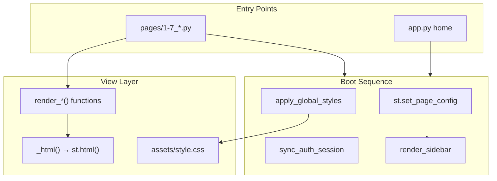

# Luồng Khởi tạo Giao diện & Routing

> Walkthrough code: multi-page Streamlit, CSS injection, DataFrame → HTML hero cards.  
> Tham chiếu: [`PROJECT_CONTEXT.md`](../../PROJECT_CONTEXT.md) · Home: [`app.py`](../../app.py) · View: [`ui_components.py`](../../ui_components.py)

---

## Tổng quan kiến trúc View



---

## Phần 1: Multi-page routing Streamlit

### 1.1. Cơ chế

Streamlit tự discover mọi file `.py` trong thư mục `pages/`:

| File | URL slug | Sidebar label |
|------|----------|---------------|
| `app.py` | `/` | Trang chủ |
| `pages/1_Du_Doan.py` | `/Du_Doan` | Khu vực dự đoán |
| `pages/2_Lich_Thi_Dau.py` | `/Lich_Thi_Dau` | Góc của Elu |
| `pages/3_Bang_Xep_Hang.py` | `/Bang_Xep_Hang` | Bảng xếp hạng |
| `pages/4_Xem_Lich_Thi_Dau.py` | `/Xem_Lich_Thi_Dau` | Lịch thi đấu |
| `pages/5_Bang_Dau.py` | `/Bang_Dau` | Bảng đấu |
| `pages/6_Bracket_Knockout.py` | `/Bracket_Knockout` | Bracket Knock-out |
| `pages/7_Tra_Cuu_Doi_Bong.py` | `/Tra_Cuu_Doi_Bong` | Tra cứu đội hình |

- Prefix số (`1_`, `2_`, …) điều khiển thứ tự sidebar mặc định Streamlit.
- App **ẩn** sidebar mặc định (`initial_sidebar_state="collapsed"`) và dùng sidebar custom.

### 1.2. Map nội bộ — `_INTERNAL_PAGE_MAP`

```340:349:ui_components.py
_INTERNAL_PAGE_MAP = {
    "/": "app.py",
    "/Du_Doan": "pages/1_Du_Doan.py",
    "/Lich_Thi_Dau": "pages/2_Lich_Thi_Dau.py",
    "/Bang_Xep_Hang": "pages/3_Bang_Xep_Hang.py",
    ...
}
```

Dùng bởi `internal_nav_url()` và `render_home_cta_cards()` để build link giữ auth params.

---

## Phần 2: Boot sequence — mọi page

Pattern lặp lại trên **tất cả** controller:

```python
st.set_page_config(page_title=..., page_icon=..., layout="wide", ...)
apply_global_styles()
sync_auth_session()
render_sidebar()
# ... logic page ...
```

### 2.1. Home — `app.py`

```12:21:app.py
st.set_page_config(
    page_title="World Cup 2026 Predictor",
    page_icon="🏆",
    layout="wide",
    initial_sidebar_state="collapsed",
)
apply_global_styles()
sync_auth_session()
render_sidebar()
```

Sau boot, home gọi View functions:

| Thứ tự | Hàm | Mục đích |
|--------|-----|----------|
| 1 | `render_hero_home()` | Banner hero |
| 2 | `render_stat_cards([...])` | 4 thẻ thống kê (+3, +1, 10k, 104) |
| 3 | `render_home_rules_section()` | HTML thể lệ (local trong app.py, dùng `st.html`) |
| 4 | `render_home_cta_cards([...])` | 5 card điều hướng |

Home **không** load Google Sheets — pure View.

---

## Phần 3: CSS injection — `apply_global_styles()`

```38:45:ui_components.py
def apply_global_styles():
    css_path = Path(__file__).parent / "assets" / "style.css"
    css = css_path.read_text(encoding="utf-8")
    st.markdown(f"<style>{css}</style>", unsafe_allow_html=True)
```

Toàn bộ design system (~3000+ dòng CSS) inject một lần mỗi rerun qua `st.markdown(..., unsafe_allow_html=True)`.

### 3.1. Sidebar overlay JS

Tiếp theo, hàm inject script `_SIDEBAR_OVERLAY_BOOT` qua:

```python
components.html(_SIDEBAR_OVERLAY_BOOT, height=0)
```

Xử lý hamburger menu mobile — toggle class overlay trên sidebar custom.

---

## Phần 4: Wrapper HTML — `_html()`

```35:36:ui_components.py
def _html(content: str):
    st.html(content)
```

**Quy tắc kiến trúc** (`.cursorrules`): mọi custom UI phải qua `_html()` / `st.html()`, không scatter `st.markdown(unsafe_allow_html=True)` trừ CSS global.

Class CSS chuẩn: `stat-card`, `stats-row`, `lb-hero-card`, `page-header`, v.v.

---

## Phần 5: Navigation — `render_sidebar()`

```382:411:ui_components.py
def render_sidebar():
    with st.sidebar:
        _html('<div class="sidebar-brand">...</div>')
        _html('<div class="sidebar-section-label">...</div>')
        st.page_link("app.py", label="Trang chủ", icon="🏠")
        st.page_link("pages/1_Du_Doan.py", label="Khu vực dự đoán", icon="✍️")
        ...
        st.page_link("pages/2_Lich_Thi_Dau.py", label="Góc của Elu", icon="⚙️")
```

- Brand block: HTML qua `_html()` — classes `sidebar-brand`, `sidebar-brand-icon`.
- Links: **`st.page_link()`** — API Streamlit native multi-page.
- Tip box: class `sidebar-tip`.

### 5.1. Giữ auth khi navigate — `internal_nav_url()`

```327:338:ui_components.py
def internal_nav_url(href, params=None):
    signed_query = _auth_query_params(query)
    # _auth_query_params thêm uid + sig nếu đã login
    return f"{parsed.path}{suffix}"
```

CTA cards trên home dùng href `/Du_Doan`, `/Bang_Xep_Hang`, … kèm query params HMAC.

---

## Phần 6: Hero Cards BXH — pipeline DataFrame → HTML

**Quan trọng:** Hero cards **không** render mọi hàng leaderboard. Chỉ chọn **3 player highlight**.

### 6.1. Entry từ controller

[`pages/3_Bang_Xep_Hang.py`](../../pages/3_Bang_Xep_Hang.py):

```python
leaderboard = build_leaderboard_with_dynamics(users_df, preds_df, finished_matches)
scored_df_for_cards = build_scored_predictions(preds_df, finished_matches, users_df)
st.session_state["scored_df"] = scored_df_for_cards
render_lb_hero_cards(leaderboard)
render_leaderboard_dataframe(leaderboard, ...)
render_lb_hero_cards_mobile_compact(leaderboard)
```

Controller tính biến → View render. Không viết HTML trong page controller.

### 6.2. Call chain desktop

```
render_lb_hero_cards(lb)                              # L950
  └─ _html(_render_lb_hero_cards_desktop_html(lb))      # L954
       └─ _lb_hero_cards_payload(lb)                    # L819
       └─ _render_lb_hero_card_html(**card) × 3         # L903
```

### 6.3. Chọn 3 player — `_lb_hero_cards_payload()`

#### Card 1: SIUUUU (Vua điểm) — `_pick_hero_king()`

```797:800:ui_components.py
def _pick_hero_king(lb):
    return lb.sort_values(["points", "fines", "name"], ascending=[False, True, True]).iloc[0]
```

Pandas sort: điểm cao nhất → ít phạt hơn → tên A→Z. Lấy `.iloc[0]`.

Metric hiển thị: `"{points} điểm - với tỉ lệ trúng {hit_rate}%"`.

#### Card 2: Panic buyer — logic `scored_df`

```834:853:ui_components.py
if "scored_df" in st.session_state:
    df_panic["kickoff_vn"] = pd.to_datetime(..., format="mixed", errors="coerce", utc=True)
    df_panic["timestamp"] = pd.to_datetime(..., format="mixed", errors="coerce", utc=True)
    df_panic["delta_mins"] = (kickoff_vn - timestamp).dt.total_seconds() / 60.0
    fail_sps = df_panic[(delta_mins > 0) & (delta_mins <= 60) & (match_pts == 0)]
    counts = fail_sps.groupby("name").size()
    top_overthinker = counts.sort_values(by=["fails", "name"], ascending=[False, True]).iloc[0]
```

Tìm người chốt kèo **≤60 phút** trước kickoff và **đoán sai** (`match_pts == 0`).

**Fallback** (L856–861): nếu không có `scored_df`, lấy `hit_rate` thấp nhất trong nhóm `played >= 5`.

#### Card 3: Khổ qua dĩa lớn — `_pick_hero_shame()`

```813:816:ui_components.py
def _pick_hero_shame(lb):
    return lb.sort_values(["fines", "points", "name"], ascending=[False, False, True]).iloc[0]
```

Phạt cao nhất → metric `"{fines}k phạt"`. Class modifier: `lb-hero-card--shame`.

### 6.4. Build HTML card — `_render_lb_hero_card_html()`

```903:919:ui_components.py
def _render_lb_hero_card_html(*, icon, title, name, metric, extra_class=""):
    cls = f"lb-hero-card {extra_class}".strip()
    return (
        f'<div class="{cls}">'
        f'<div class="lb-hero-card-icon">{html.escape(icon)}</div>'
        f'<div class="lb-hero-card-title">{html.escape(title)}</div>'
        f'<div class="lb-hero-card-name">{html.escape(name)}</div>'
        f'<div class="lb-hero-card-metric">{html.escape(metric)}</div>'
        f"</div>"
    )
```

- F-string HTML — **không** dùng template engine.
- `html.escape()` trên mọi text user-generated (tên người chơi).

### 6.5. Wrap grid desktop

```922:929:ui_components.py
def _render_lb_hero_cards_desktop_html(lb):
    cards = "".join(_render_lb_hero_card_html(**card) for card in _lb_hero_cards_payload(lb))
    return (
        '<div class="lb-hero-desktop-marker" aria-hidden="true"></div>'
        f'<div class="lb-hero-grid lb-hero-grid--desktop">{cards}</div>'
    )
```

### 6.6. Render cuối — `render_lb_hero_cards()`

```950:954:ui_components.py
def render_lb_hero_cards(lb):
    if lb.empty:
        return
    _html(_render_lb_hero_cards_desktop_html(lb))
```

Early return nếu BXH rỗng.

---

## Phần 7: Mobile hero strip

`render_lb_hero_cards_mobile_compact()` (L957–961) — cùng payload `_lb_hero_cards_payload()`, nhưng HTML compact:

| Class | Vai trò |
|-------|---------|
| `lb-hero-mobile-compact-marker` | CSS media query hook |
| `lb-hero-strip` | Container ngang |
| `lb-hero-chip` | Chip từng card |
| `lb-hero-chip--shame` | Modifier card phạt |
| `lb-hero-chip-icon/title/name/metric` | Nội dung |

CSS định nghĩa trong `assets/style.css` (~dòng 3385+): desktop marker ẩn trên mobile và ngược lại.

---

## Phần 8: Leaderboard table — `render_leaderboard_dataframe()`

Tương tự hero cards, hàm này nhận DataFrame `lb` và build HTML:

- Header: classes `lb-list`, `lb-col-rank`, `lb-col-name`, …
- Mỗi row: iterate `lb.iterrows()`, format điểm/phạt/HP/badge chips.
- Output qua `_html()`.

Controller **không** dùng `st.dataframe()` cho BXH chính — tuân `.cursorrules` (custom HTML).

---

## Phần 9: Quy tắc MVC từ `.cursorrules`

| Lớp | Trách nhiệm | Ví dụ |
|-----|-------------|-------|
| Controller (`pages/*.py`) | Load data, gọi service, truyền DataFrame | `3_Bang_Xep_Hang.py` gọi `build_leaderboard_with_dynamics()` |
| Service | Tính toán | `leaderboard_service`, `achievement_service` |
| View (`ui_components.py`) | Render HTML | `render_lb_hero_cards()`, `render_stat_cards()` |

**Cấm:** Dùng `st.metric` cho banner/dashboard quan trọng (trừ debug).

**Bắt buộc:** Hero cards BXH qua `render_lb_hero_cards(leaderboard)`.

---

## Phần 10: Sơ đồ DataFrame row → HTML (hero card)

```
leaderboard DataFrame (N rows)
        │
        ├─ _pick_hero_king(lb)     → pd.Series row → dict card
        ├─ panic logic (scored_df) → computed name/metric → dict card
        └─ _pick_hero_shame(lb)    → pd.Series row → dict card
                │
                ▼
        _lb_hero_cards_payload(lb) → list[dict] (3 items)
                │
                ▼
        _render_lb_hero_card_html(**card) × 3
                │
                ▼
        _render_lb_hero_cards_desktop_html(lb)
                │
                ▼
        render_lb_hero_cards(lb) → _html() → st.html()
                │
                ▼
        Browser render + assets/style.css
```

Mỗi dict card có keys: `icon`, `title`, `name`, `metric`, `extra_class` — map 1:1 vào HTML template.

---

## Phần 11: Các render function quan trọng khác

| Hàm | Dùng ở | Input |
|-----|--------|-------|
| `render_page_header()` | Mọi page | title, subtitle, variant |
| `render_stat_cards()` | Home, BXH, Lịch | list tuple (value, label) |
| `render_outcome_picker()` | Dự đoán | team_a, team_b, widget_key |
| `render_fixture_row()` | Lịch thi đấu | match Series |
| `render_knockout_bracket()` | Bracket | bracket tree dict |
| `render_badge_collection_board()` | BXH tab 2 | bundle từ `build_badge_collection_bundle()` |
| `custom_loader()` | Context manager | spinner text khi load data |

Tất cả follow pattern: nhận data đã tính → build HTML string → `_html()`.

**Ngoại lệ — PEN picker knock-out:** CSS class `pen-picker-shell` / `pen-picker-label` được inject từ **controller** [`pages/1_Du_Doan.py`](../../pages/1_Du_Doan.py) qua `_html()`, không nằm trong `ui_components.py`. Selectbox Streamlit render có điều kiện theo `show_pen_picker` (chỉ khi knock-out + Hòa). Chi tiết: [`03_User_Interaction_Flow.md`](03_User_Interaction_Flow.md) Phần 4.4.
