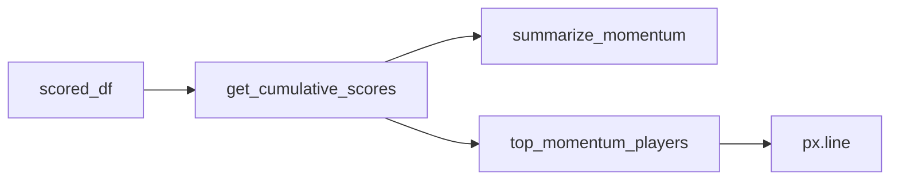
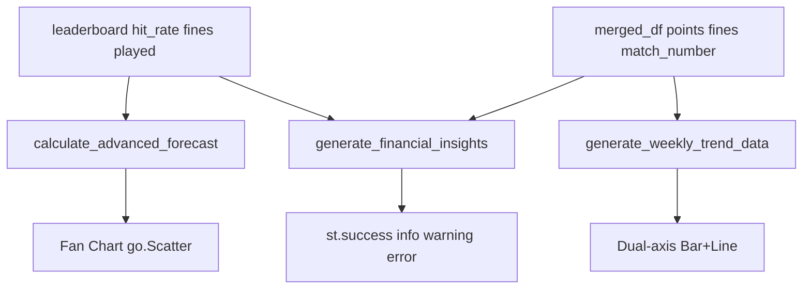

# Luồng Phân tích Dữ liệu Hành vi

> Walkthrough code: tab **Phân tích dữ liệu hành vi** trên trang Bảng xếp hạng — 5 sub-tab analytics, trọng tâm **Fund Forecast**.  
> Tham chiếu: [`PROJECT_CONTEXT.md`](../../PROJECT_CONTEXT.md) · Controller: [`pages/3_Bang_Xep_Hang.py`](../../pages/3_Bang_Xep_Hang.py) · Logic: [`analytics_service.py`](../../analytics_service.py) · View: [`ui_components.py`](../../ui_components.py)

---

## Tổng quan kiến trúc

Tab analytics là **tab3** trong [`pages/3_Bang_Xep_Hang.py`](../../pages/3_Bang_Xep_Hang.py), bên cạnh Leaderboard và Bộ sưu tập danh hiệu. Dữ liệu đầu vào được load một lần ở đầu page qua `load_data_for_ranking()` (cache 300s), sau đó lọc các trận đã có tỉ số thật.

```mermaid
flowchart TB
  Markdown Preview Github Stylingload[load_data_for_ranking]
  guard{Có trận đã đá?}
  tab3[tab3 Phân tích hành vi]
  bundle[build_analytics_bundle]
  subs[render_analytics_sub_tabs x5]Markdown Preview Github Styling

  load --> guard
  guard -->|không| stop[st.info + st.stop]
  guard -->|có| tab3
  tab3 --> bundle
  bundle --> subs
  subs --> mom[Momentum]
  subs --> acc[Accuracy]
  subs --> lead[Lead Time]
  subs --> risk[Risk Bias]
  subs --> fund[Fund Forecast]
```

**Điểm vào controller:**

```320:333:pages/3_Bang_Xep_Hang.py
with tab3:
    _html('<div class="lb-analytics-panel-marker" aria-hidden="true"></div>')
    render_analytics_section_header(
        eyebrow="Insights",
        title="Phân tích dữ liệu hành vi",
        subtitle="Who's climbing the ranks, how picks match results, and when people lock in predictions.",
    )
    scored_df, cumulative_df, lead_df, lead_stats, consensus_df, risk_profile_df = build_analytics_bundle(
        users_df, preds_df, matches_df, finished_matches
    )
    t_mom, t_acc, t_lead, t_risk, t_fund = render_analytics_sub_tabs(
        ["🏁 Momentum", "🎯 Accuracy", "⏱️ Lead Time", "🎲 Risk Bias", "💰 Fund Forecast"]
    )
```

---

## Bundle dùng chung — `build_analytics_bundle()`

Hàm cache trong controller gom 6 DataFrame/dict phục vụ 4 tab đầu. **Fund Forecast không nằm trong bundle** — tab đó đọc `leaderboard` (tính ở tab Leaderboard) và `merged_df` (merge preds × finished ở scope page).

```128:136:pages/3_Bang_Xep_Hang.py
@st.cache_data(ttl=300, show_spinner=False)
def build_analytics_bundle(users_df, preds_df, matches_df, finished_matches_df):
    scored_df = build_scored_predictions(preds_df, finished_matches_df, users_df)
    cumulative_df = get_cumulative_scores(scored_df)
    lead_df = get_prediction_lead_time(preds_df, matches_df, users_df)
    stats = lead_time_stats(preds_df, lead_df)
    consensus_df = calculate_crowd_consensus(preds_df)
    risk_profile_df = get_user_risk_profile(preds_df, consensus_df, users_df)
    return scored_df, cumulative_df, lead_df, stats, consensus_df, risk_profile_df
```

| Output | Hàm trong `analytics_service.py` | Sub-tab |
|--------|-----------------------------------|---------|
| `scored_df` | `build_scored_predictions()` | Accuracy |
| `cumulative_df` | `get_cumulative_scores()` | Momentum |
| `lead_df` | `get_prediction_lead_time()` | Lead Time |
| `lead_stats` | `lead_time_stats()` | Lead Time |
| `consensus_df` | `calculate_crowd_consensus()` | Risk Bias |
| `risk_profile_df` | `get_user_risk_profile()` | Risk Bias |

**Hàm nền `build_scored_predictions()`** — inner-merge `predictions` × trận đã đá, gọi `calculate_points()` từ [`scoring.py`](../../scoring.py), suy ra `actual_outcome` (A/D/B), chuẩn hóa `pred_outcome`, join tên user, lọc eligibility (`active_from_kickoff` qua `user_service.is_match_eligible`).

---

## Sub-tab 1 — Momentum (🏁)

### Mục tiêu UX

Biểu đồ **cuộc đua điểm tích lũy**: mỗi đường là tổng điểm một người sau từng trận đã có kết quả (theo thứ tự `kickoff_vn`).

### Pipeline



1. **`get_cumulative_scores(scored_df)`** — sort theo `kickoff_vn` / `match_number`, `groupby("user_id")["points"].cumsum()` → cột `cumulative_points`.
2. **`summarize_momentum()`** — lấy `_latest_per_user()` (điểm cuối mỗi user), xác định leader; so sánh gain ở trận kickoff cuối cùng để tìm người cộng nhiều điểm nhất trận vừa qua.
3. **`top_momentum_players(limit=6, highlight_user_id=...)`** — top 6 theo điểm tích lũy; nếu user đăng nhập không nằm top 6 thì thêm vào plot.
4. **Plotly `px.line`** — trục X: `kickoff_vn`, Y: `cumulative_points`, color: `name`; layout dark mode qua `chart_layout`.

### UI

- `render_analytics_guide` — giải thích: đường ngang = không dự đoán trận đó; chỉ tính trận đã đá (phạt bỏ lỡ không hiện trên biểu đồ).
- `render_analytics_insight_chips` — leader, điểm hiện tại, gain trận cuối, số người có dự đoán.
- `render_analytics_takeaway(format_momentum_takeaway(mom_summary))` — câu tóm tắt tự nhiên.

### Edge case

`cumulative_df.empty` → `st.info("Chưa có dữ liệu để vẽ cuộc đua điểm.")`.

---

## Sub-tab 2 — Accuracy (🎯)

### Mục tiêu UX

**Ma trận nhầm lẫn 3×3** (Actual × Predicted) cho từng người — ô chéo = đoán đúng hướng kết quả (A thắng / Hòa / B thắng).

### Pipeline

1. **`get_confusion_matrix(scored_df, user_id)`** — lọc user, bỏ row thiếu outcome; `pd.crosstab(actual_outcome, pred_outcome)`; reindex theo `OUTCOME_ORDER = ("A", "D", "B")`, fill 0.
2. **`summarize_accuracy(matrix, user_name)`**:
   - `hits` = tổng đường chéo
   - `accuracy_pct` = hits / total × 100
   - `favorite_label` = cột dự đoán nhiều nhất
   - `weak_actual` / `weak_pred` = ô off-diagonal lớn nhất (điểm yếu)
3. **Plotly `px.imshow`** — heatmap 3×3, scale tối → xanh → vàng; `text_auto=True` hiện số lần.

### Controller

- `st.selectbox("Chọn người chơi")` — default = user đăng nhập nếu có trong danh sách.
- Layout 2 cột: trái chips + takeaway, phải heatmap.

### Edge case

User chưa có dự đoán trên trận đã đá → `acc_summary["total"] == 0` → `st.info`.

---

## Sub-tab 3 — Lead Time (⏱️)

### Mục tiêu UX

Phân tích **thói quen thời điểm gửi dự đoán**: bao nhiêu giờ trước giờ bóng lăn (timezone VN).

### Pipeline

1. **`get_prediction_lead_time(preds_df, matches_df, users_df)`** — merge preds + kickoff từ matches; parse timestamp và kickoff về `Asia/Ho_Chi_Minh`; `lead_hours = (kickoff - timestamp).total_seconds() / 3600`; `is_late = lead_hours < 0`.
2. **`lead_time_stats(preds_df, lead_df)`** — `coverage_pct` = % dự đoán có timestamp hợp lệ; `late_count` = số lần gửi sau giờ đá.
3. **`lead_time_medians(lead_df)`** — median `lead_hours` theo user (chỉ row có timestamp).
4. **`summarize_lead_time()`** — early bird (median cao nhất), last minute (median thấp nhất), median cả nhóm.
5. **Chart chính:** `px.bar` horizontal — median giờ/người.
6. **Expander box plot:** `px.box` phân phối `lead_hours` từng người (hộp = 50% giữa, vạch = median).

### Edge cases

| Điều kiện | UI |
|-----------|-----|
| Không có dự đoán | `st.info` |
| Không ai có timestamp | `st.warning` — cần Lưu lại dự đoán |
| `coverage_pct < 50` | `st.warning` — biểu đồ có thể không đại diện |

---

## Sub-tab 4 — Risk Bias (🎲)

### Mục tiêu UX

**Wisdom of the Crowd** — không dùng tỷ lệ cược nhà cái. Mỗi trận, pick được nhiều người chọn nhất = **Cửa trên (Safe)**; chọn khác = **Cửa dưới (Risky)**.

### Pipeline

1. **`calculate_crowd_consensus(preds_df)`** — groupby `(match_id, pred_outcome)` đếm vote; tie-break theo `_OUTCOME_RANK` (A > D > B); output `favorite_pick`, `consensus_votes`, `total_votes`.
2. **`get_user_risk_profile(preds_df, consensus_df, users_df)`** — merge pick user với `favorite_pick`; `pick_type = Safe if pred == favorite else Risky`; tính `%` Safe/Risky per user (stacked 100%).
3. **`summarize_risk_bias()`** — người Safe % cao nhất / Risky % cao nhất.
4. **Plotly `px.bar`** — `barmode="stack"`, trục Y 0–100%, màu `RISK_CHART_COLORS`.

### Khác biệt quan trọng

Risk Bias dùng **toàn bộ** `preds_df` (mọi dự đoán đã lưu), không chỉ trận đã đá — khác với Momentum/Accuracy chỉ dùng `finished_matches`.

---

## Sub-tab 5 — Fund Forecast (💰)

Tab phức tạp nhất: kết hợp **dự báo quỹ phạt (Expected Value)**, **khoảng tin cậy**, **fan chart**, **phân tích theo giai đoạn**, và **6 loại insight tự động**.

### Luồng tổng thể



### Nguồn dữ liệu

| Biến | Nguồn | Cột quan trọng |
|------|-------|----------------|
| `leaderboard` | `build_leaderboard_with_dynamics()` — xem [`02_Gamification_Scoring_Flow.md`](02_Gamification_Scoring_Flow.md) | `fines` (×1000 VNĐ), `hit_rate`, `played`, `name` |
| `merged_df` | merge `preds_df` × `finished_matches` + `calculate_points` / `calculate_fines` ở controller | `points`, `fines`, `match_number`, timestamp |
| Hằng số UI | `pages/3_Bang_Xep_Hang.py` | `TARGET_FUND = 11_000_000`, `TOTAL_MATCHES = 104` |

Quy đổi tiền: **1 đơn vị `fines` = 1.000 VNĐ** (phạt 10k → lưu `10`).

---

### 5.1. Mô hình EV cơ bản — `calculate_fund_forecast()`

Dự báo tổng quỹ cuối giải bằng **giá trị kỳ vọng (Expected Value)** trên từng user:

```python
# Pseudocode — analytics_service.py
for each user in leaderboard:
    user_current_fine = fines * 1000                    # VNĐ đã nộp
    prob_correct = hit_rate / 100                       # mặc định 50% nếu chưa chơi
    prob_penalty = 1.0 - prob_correct
    expected_future = prob_penalty * remaining_matches * 10_000
    projected += user_current_fine + expected_future
```

Trong đó `remaining_matches = max(0, 104 - finished_matches_count)`.

**Baseline naive** (so sánh): `(current_fund / finished) × 104` — giả định tốc độ phạt đồng đều, không xét hit rate cá nhân.

**Ví dụ số:** User A đã nộp 50k (`fines=50`), hit rate 40%, còn 80 trận:

```
prob_penalty = 0.6
expected_future = 0.6 × 80 × 10_000 = 480_000 đ
projected_user = 50_000 + 480_000 = 530_000 đ
```

---

### 5.2. Mô hình nâng cao — `calculate_advanced_forecast()`

Hàm thực tế được tab Fund Forecast gọi. Logic EV giống trên, thêm **dải biến động (confidence interval)**:

```592:631:analytics_service.py
def calculate_advanced_forecast(leaderboard_df, finished_matches_count, target=11000000):
    ...
    for _, row in leaderboard_df.iterrows():
        user_current = int(row.get("fines", 0)) * 1000
        hit_rate = float(row.get("hit_rate", 50.0))
        prob_penalty = 1.0 - (max(0, min(100, hit_rate)) / 100.0)
        expected_future = prob_penalty * remaining_matches * PENALTY_FEE
        projected_total += (user_current + expected_future)

    base_proj = projected_total
    std_dev = leaderboard_df["fines"].std() * 1000 if "fines" in leaderboard_df.columns else 0
    margin = max(base_proj * 0.15, std_dev * 1.5)

    return {
        "lower": max(0, base_proj - margin),
        "mid": base_proj,
        "upper": base_proj + margin,
        "target": target,
        "current_fund": current_total,
    }
```

| Trường | Ý nghĩa |
|--------|---------|
| `current_fund` | Tổng phạt thực tế đến hiện tại (VNĐ) |
| `mid` | Dự báo trung bình cuối giải |
| `lower` / `upper` | Cận dưới / trên — margin = max(15% mid, 1.5× std fines) |
| `target` | 11.000.000 đ |

> **Lưu ý UI vs code:** Expander «Giải thích phương pháp tính Dự phóng» trên UI mô tả hệ số làm mượt **Learning Rate 0.85**, nhưng **`calculate_advanced_forecast()` hiện không áp dụng 0.85** — số liệu hiển thị bám theo EV thuần + margin như trên. Expander phản ánh ý định phương pháp; code là nguồn sự thật khi debug.

---

### 5.3. Fan Chart — lịch sử + dự phóng

Controller dựng biểu đồ quạt bằng **Plotly Graph Objects** (`go.Figure`):

**Bước 1 — Lịch sử quỹ tích lũy**

```python
match_fines = merged_df.groupby("match_number")["fines"].sum()
match_fines["fines_vnd"] = match_fines["fines"] * 1000
match_fines["cumulative_fund"] = match_fines["fines_vnd"].cumsum()
# hist_x = [0] + match_numbers, hist_y = [0] + cumulative values
```

**Bước 2 — Ba trace**

1. Scatter cận dưới (từ trận hiện tại → 104) — `line.width=0`, không legend.
2. Scatter cận trên + `fill='tonexty'` — vùng vàng mờ = dải biến động `[lower, upper]`.
3. Đường lịch sử + nối tới `mid` tại trận 104 — nét chấm vàng `#fbbf24`.

**Bước 3 — Đường mục tiêu**

`fig.add_hline(y=11_000_000)` — Target 11M màu đỏ.

**Stat cards** (`render_stat_cards`): Đã thu · Dự kiến mid · % đạt mục tiêu (`mid / TARGET × 100`).

---

### 5.4. Phong độ theo giai đoạn — `generate_weekly_trend_data()`

Nhóm dự đoán theo **giai đoạn thời gian** để so sánh tiền phạt thu về vs hit rate cả nhóm.

**Chiến lược nhóm (ưu tiên datetime):**

1. Tìm cột thời gian: `date_time` → `timestamp` → cột có chứa `"date"`/`"time"`.
2. Parse `pd.to_datetime(..., format="mixed", errors="coerce")`.
3. Nhóm theo **ISO week** (`dt.isocalendar().week`), đánh nhãn `Tuần N (dd/mm-dd/mm)`.
4. **Fallback** nếu không có datetime: nhóm block 10 trận (`Trận 1-10`, `11-20`, …).

**Aggregation per period:**

```python
trend_df = df.groupby([period, sort_order]).agg(
    total_predictions=("points", "count"),
    correct_predictions=("points", lambda x: (x > 0).sum()),
)
trend_df["missed_predictions"] = total - correct
trend_df["fines"] = missed * penalty_fee          # 10_000 VNĐ
trend_df["hit_rate"] = correct / total * 100
```

**Insight tự động** — so sánh tuần cuối vs tuần trước:

| Điều kiện | Thông điệp |
|-----------|------------|
| `hr_diff < -3` | Hit rate giảm mạnh → dòng tiền phạt tăng |
| `hr_diff > +3` | Hit rate tăng → quỹ hụt tiền |
| còn lại | Phong độ ổn định |

**Biểu đồ combo** — `make_subplots(secondary_y=True)`:

- **Bar đỏ** (trục trái): `fines` VNĐ — text label `Xk`
- **Line xanh** (trục phải 0–100%): `hit_rate` — markers trắng viền xanh
- Layout dark, legend ngang phía trên

---

### 5.5. Financial Insights — `generate_financial_insights()`

Hàm trả về `list[dict]` với keys `type`, `title`, `content`. Controller map `type` → widget Streamlit:

| `type` | Widget | Khi nào |
|--------|--------|---------|
| `profiling` | `st.success` | Ca ngợi / tin tốt |
| `burn_rate` | `st.info` hoặc `st.warning` | Pacing / ETA xấu |
| `what_if` | `st.error` | Kịch bản rủi ro |

**6 insight (logic chính):**

| # | Title | Công thức / điều kiện |
|---|-------|------------------------|
| 1 | Đội hình Gánh Quỹ | `expected_contribution = (1 - hit_rate/100) × remaining × 10_000`; top 2 user |
| 2 | Giải Cứu Quỹ / Mục tiêu hoàn thành | `real_gap = target - current_fund`; nếu > 0: `misses_per_person = real_gap / 10_000 / num_players` |
| 3 | Chỉ số Tiến độ (Pacing) | So `% giải đã đá` vs `% quỹ / target` |
| 4 | Rủi ro Cá Mập | Top 2 `expected_contribution` / tổng expected × 100% |
| 5 | Ngưỡng Sinh Tử | `required_hit_rate = (1 - misses_needed / total_remaining_picks) × 100` |
| 6 | ETA Deadline | `avg_fine_per_match = current / finished`; `projected_match = finished + real_gap / avg` |

Insight 5 có nhánh đặc biệt: nếu cần nhiều lần sai hơn tổng pick còn lại → «Target đã vỡ».

Sau vòng insight, controller thêm banner tổng:

- `forecast["mid"] >= TARGET` → `st.success` dư tiền nhậu
- ngược lại → `st.warning` thiếu bao nhiêu để cán 11M

---

### 5.6. Expander phương pháp luận

**«Giải thích phương pháp tính Dự phóng»** — markdown 3 bước EV + bảng biến số (`Hit Rate`, `Remaining Matches`, `Penalty Fee`); kèm bảng `st.table` giá trị trung bình nhóm.

**«Tại sao lại dự phóng con số này?»** — breakdown 4 hàng: Tiền đã thu · Dự kiến nộp thêm · Tổng quỹ cuối mùa · Mục tiêu 11M.

---

## UI layer chung

Các hàm render trong [`ui_components.py`](../../ui_components.py):

| Hàm | Vai trò |
|-----|---------|
| `render_analytics_section_header` | Eyebrow + title + subtitle tab chính |
| `render_analytics_sub_tabs(labels)` | 5 sub-tab custom HTML (trả về 5 context manager) |
| `render_analytics_guide` | Khối icon + summary + bullet tips |
| `render_analytics_insight_chips` | KPI chips — tuple `(value, label, tone)` với tone `gold/ok/info/bad/muted` |
| `render_analytics_takeaway` | Một câu kết luận dưới biểu đồ |

**`chart_layout`** (dict trong controller) — nền trong suốt, font Inter `#cbd5e1`, dùng chung Momentum/Accuracy/Lead/Risk.

---

## Bảng dependency — Input → Output

| Sub-tab | Input chính | Output UI |
|---------|-------------|-----------|
| Momentum | `scored_df` → `cumulative_df` | Line chart + chips |
| Accuracy | `scored_df` + user pick | Heatmap 3×3 + accuracy % |
| Lead Time | `preds_df`, `matches_df` | Bar median + box plot |
| Risk Bias | `preds_df`, `consensus_df` | Stacked bar Safe/Risky |
| Fund Forecast | `leaderboard`, `merged_df` | Fan chart + combo chart + 6 insights |

---

## Edge cases tổng hợp

| Tình huống | Hành vi |
|------------|---------|
| Chưa có kết quả trận nào | Page `st.stop()` trước khi vào tab analytics |
| `scored_df` rỗng | Momentum / Accuracy hiện `st.info` |
| Không timestamp lead time | Warning + hướng dẫn Lưu lại dự đoán |
| `consensus_df` rỗng | Risk Bias `st.info` |
| `merged_df` rỗng cho trend | Caption «Chưa đủ dữ liệu thời gian» |
| `leaderboard` rỗng | Insights trả `[]` |

---

## Liên kết luồng liên quan

- **Nguồn dữ liệu Sheet → DataFrame:** [`01_Data_Pipeline_Flow.md`](01_Data_Pipeline_Flow.md)
- **Tính `hit_rate`, `fines`, leaderboard:** [`02_Gamification_Scoring_Flow.md`](02_Gamification_Scoring_Flow.md)
- **Luồng user lưu dự đoán (timestamp):** [`03_User_Interaction_Flow.md`](03_User_Interaction_Flow.md)

**Demo:** [wc2026-elu.streamlit.app](https://wc2026-elu.streamlit.app) → `/Bang_Xep_Hang` → tab **Phân tích dữ liệu hành vi**.
